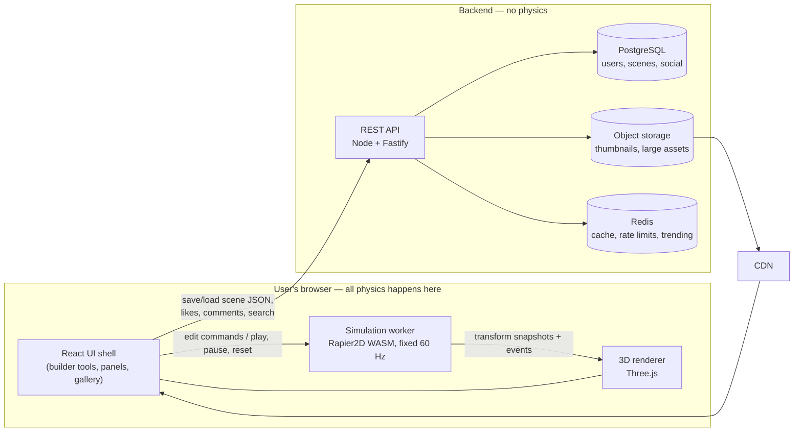
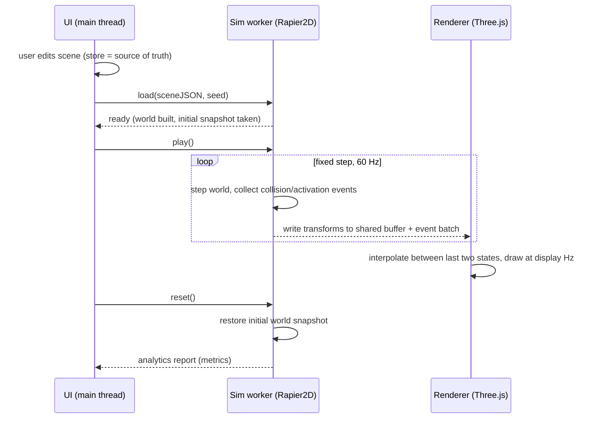

# 01 — System Architecture Overview

**Status:** Accepted (Session 1, 2026-07-19)
**Depends on:** ADR-0001 … ADR-0005
**Refined by:** M1 (scene format), M2 (simulation core), M4 (backend detail)

---

## 1. Goals and non-goals

**Goals**

- All physics runs in the user's browser. The backend never simulates.
- Deterministic simulation: same scene + same seed + same engine version → identical result on every machine.
- Smooth with thousands of objects on mid-range hardware.
- Scenes are small, versioned JSON documents that describe *inputs* (objects, transforms, properties, seed) — never simulation results.
- Backend is a thin, cheap, scalable CRUD + social layer.

**Non-goals (for MVP)**

- No real-time multiplayer editing (roadmap item, M10).
- No server-side physics validation at launch (spot-check design comes in M7).
- No native mobile apps; responsive web only.

---

## 2. System context

Key property: the expensive part (simulation) scales with the number of users' devices, not with our servers. The backend cost profile is that of a simple content/social app.

---

## 3. Client architecture

### 3.1 Thread model

| Thread | Responsibility |
|--------|----------------|
| Main thread | React UI, builder interactions, Three.js rendering (WebGL2; WebGPU as later opt-in) |
| Simulation worker | Rapier2D WASM world; fixed-timestep stepping; event collection; analytics accumulation |
| (Optional later) Asset worker | Thumbnail rendering, scene serialization/compression off the main thread |

Simulation runs in a dedicated Web Worker so heavy scenes never block the UI. Transport of per-frame transforms uses `SharedArrayBuffer` when cross-origin isolation is available, with a fallback to transferable `ArrayBuffer`s (double-buffered) when it isn't. (Header/embedding consequences: see Risks, R5.)

### 3.2 The 2.5D model (from ADR-0001)

- Physics lives on a single X/Y plane, simulated by Rapier2D.
- Every object gets a visual depth (Z extrusion / 3D mesh) for rendering only. Z never affects simulation.
- The camera is a 3D perspective camera, default slightly tilted ("workshop table" view); builder input is raycast onto the physics plane, so editing feels 2D.
- The brief's *plane angle* parameter maps to the gravity vector's direction/magnitude in the 2D world (plus a matching camera/board tilt purely for looks).

### 3.3 Data flow (edit → simulate → render)

Rules that keep this clean:

1. **Edit mode:** the scene store (Zustand) on the main thread is the single source of truth. The worker holds no world, or a stale one.
2. **Play mode:** the worker's physics world is the single source of truth. The UI is read-only over the running simulation (no live editing in MVP).
3. Play always starts from a fresh deserialization of the scene JSON — never from mutated leftover state. Reset restores the initial snapshot (Rapier supports full world snapshot/restore).
4. Renderer interpolates between the last two physics states, so display frame rate is decoupled from the fixed 60 Hz simulation rate.

### 3.4 Determinism contract (spec detail in M2)

- Fixed timestep (1/60 s), fixed solver iteration counts.
- Deterministic Rapier build (`enhanced-determinism`, IEEE 754 strict) — see Risk R1.
- Bodies inserted in stable order (sorted by object ID) — insertion order affects solver results.
- One seeded PRNG (PCG32) owned by the worker; `Math.random` is banned in simulation code.
- Custom forces (fans, magnets, conveyor surface velocity, motors) applied in a fixed, documented order each step.
- Scene JSON records the `engineVersion`; replays and leaderboard entries are only comparable within the same engine version.

### 3.5 Analytics

The worker accumulates metrics during simulation from the event stream (collision pairs, first-motion "activation" per object, speeds): duration, objects activated, chain-reaction count, max speed, longest collision chain, success/failure, efficiency score. Exact definitions and algorithms: M2. Results are reported to the UI at stop and attached (client-signed only, see Risk R2) to leaderboard submissions.

---

## 4. Backend architecture

Thin REST API (OpenAPI-first), stateless, horizontally scalable. Detail in M4; shape below.

| Concern | Approach |
|---------|----------|
| Auth | Email + OAuth (Google/GitHub); session cookie for web; detail in M4 |
| Scenes | Versioned JSON documents; MVP: Postgres `JSONB` column with size cap (~1 MB compressed); migrate blobs to object storage if sizes grow (open question U3) |
| Thumbnails | Rendered client-side (canvas capture), uploaded as PNG/WebP to object storage, served via CDN |
| Social | Likes, comments, follows, remix lineage (`remixed_from` scene reference) in Postgres |
| Search & browse | Postgres full-text + trigram for MVP; dedicated search engine only if needed later |
| Trending / leaderboards | Periodic jobs computing scores into materialized tables; Redis for hot reads |
| Sharing | Public URL `/s/{scene_id}`; share page server-renders metadata (OG tags) and loads the player |
| Anti-abuse | Rate limits (Redis), size caps, JSON schema validation on upload — the same `scene-format` package validates on client and server (one reason for a TypeScript backend, ADR-0004) |

**Optional future capability worth designing for now:** because the engine is deterministic WASM, the *same* module can run in Node. That allows server-side spot verification of suspicious leaderboard entries without a full "server physics" architecture. Decision deferred to M7.

---

## 5. Key flows

**Save / share:** UI serializes store → scene JSON → schema-validate → `POST /scenes` → server re-validates, stores, returns id → share URL.

**Load / play:** `GET /scenes/{id}` → validate + migrate old versions forward (migration functions live in `scene-format`) → hydrate store → user hits Play.

**Remix:** `POST /scenes/{id}/remix` clones the scene with `remixed_from` set; the lineage chain is queryable for attribution and "remix tree" displays.

**Procgen / AI generation (M5/M6):** both output ordinary scene JSON through the same validation gate as human-built scenes. Procgen runs fully client-side (seeded, thus reproducible); AI generation calls a backend endpoint that talks to the LLM provider, then the client validates + auto-repairs before load.

---

## 6. Cross-cutting concerns

- **Versioning:** three independent version numbers — scene `schemaVersion` (integer, with forward migrations), `engineVersion` (semver, pinned per leaderboard), app version. Rules in ADR-0005.
- **Feature detection:** WebGL2 baseline; capability check at boot with graceful messaging for unsupported browsers. WebGPU behind a flag later.
- **Security:** scenes are data, never code. No user-provided scripts in MVP (a future "custom logic" feature would need sandboxing design).
- **Privacy:** scenes private by default; explicit publish step makes them public/listed.

---

## 7. Risks and open questions

| # | Risk / question | Impact | Mitigation / owner milestone |
|---|-----------------|--------|------------------------------|
| R1 | Rapier `enhanced-determinism` flag likely requires a custom WASM build (standard npm package may not enable it) | Determinism is a core promise | Spike at start of M2; fallback: pin single official build + accept per-platform variance only if spike fails (would weaken leaderboards) |
| R2 | Client-computed metrics can be forged (leaderboards) | Community trust | Replay-verification design in M7 (Node runs same WASM); rate limits meanwhile |
| R3 | Fans, magnets, rope/pulleys are not native Rapier concepts | Object catalog completeness | Custom force-field layer + joint compositions; design in M2, catalog in M1 |
| R4 | "Thousands of objects" both simulated and rendered | Core UX promise | 2D physics keeps sim cheap; instanced rendering (`InstancedMesh` per object type); perf budget in M8 |
| R5 | `SharedArrayBuffer` needs COOP/COEP headers → third-party embeds of share pages get complicated | Sharing reach | Fallback transport works without SAB; embed strategy decided in M9 |
| R6 | Scene JSON size vs. object count (5k objects ≈ ~1 MB raw) | Storage, load time | Compact property encoding in M1; gzip in transit; binary packing only if needed later |
