# 04 — Builder UX/UI Specification

**Status:** Accepted (Session 4, 2026-07-19) — normative for the builder, test mode, and player UI
**Implements:** brief item 5; the UI half of ADR-0003
**Consumes:** `02-SCENE-FORMAT.md` (catalog, anchors, validation), `03-SIMULATION-CORE.md` (§5 protocol, §5.5 interpolation, §9 lifecycle, §10 analytics), `types/scene.ts`, `types/protocol.ts`
**Companion file:** `types/editor.ts` (tool/command/keymap/inspector-descriptor types + editor constants — the machine-checked half of this spec)
**Consumed by:** M4 (save/share API needs), M5/M6 (Generate entry point), M7 (gallery/player detail), M8 (rendering budget)

---

## 1. Scope and design pillars

This spec covers the **builder** (edit + test mode), the **player** page, and the **gallery entry point**. Auth dialogs and profile pages are M4/M7; visual design (final colors, typography, icons) is intentionally out — this is structure, behavior, and contracts.

Pillars, in priority order:

1. **Desk-toy directness.** Everything is manipulated on the canvas with immediate feedback; panels are for precision, never the primary path. Placing 50 dominoes must feel like play, not data entry.
2. **Catalog-shaped editing.** Every handle edits a catalog prop (`w`, `r`, `len`, `sweep`…), never a free transform matrix. What the user can make is exactly what the format can say (02 §5.3) — no dead ends at save time.
3. **One loop: build → test → tweak.** Entering and leaving test mode is one key. Determinism is surfaced, not hidden: Reset + Play replays the identical run, and the UI never pretends live-editing a running sim works (01 §3.3).
4. **Keyboard-fast, touch-capable.** Desktop with a keyboard is the primary authoring tier; tablets are first-class for building; phones are a play/tweak tier.
5. **The store is law.** All edits are `EditorCommand`s against the Zustand scene store (ADR-0003); rendering, validation, undo, autosave, and serialization all derive from it.

---

## 2. Screen map

| Route | Screen | Purpose |
|---|---|---|
| `/` | Landing | Marketing + "Start building" + gallery teaser. Not specced further here. |
| `/build` | Builder (new scene) | Opens the template picker (§5.1), then the editor. |
| `/build/{sceneId}` | Builder (existing) | Loads own scene or a remix draft. |
| `/s/{sceneId}` | Player | Public share page: play + analytics + remix. Server-renders OG metadata (01 §5). §11. |
| `/explore` | Gallery | Browse/search/trending entry point; card grid. Detail in M7; card contract in §11.3. |

Mode structure inside the builder:

```mermaid
stateDiagram-v2
    direction LR
    state Builder {
        Edit --> Test : P / ▶ (validate → load → play)
        Test --> Edit : Esc / ✎ (worker reset; world kept stale)
    }
    state Test {
        loading --> ready : loaded
        ready --> running : play
        running --> paused : pause
        paused --> running : play
        running --> finished : finish conditions (03 §9.2)
        paused --> finished : stop
        finished --> ready : reset
    }
```



Test-mode substates mirror the worker FSM (03 §5.1) one-to-one; the UI holds no state the worker doesn't confirm (every command is acked). `error` from the worker surfaces per §8.6 and returns the UI to Edit.

---

## 3. Builder layout

### 3.1 Edit mode

```
┌────────────────────────────────────────────────────────────────────────────┐
│ ⌂  Marble spiral ✎        ↶ ↷      │▶ Test│        ⟳saved  [Generate] [☰] │ top bar
├──────────┬──────────────────────────────────────────────────┬──────────────┤
│ PALETTE  │  tool options row (contextual: spacing, snap…)   │ INSPECTOR    │
│ 🔍 /     ├──────────────────────────────────────────────────┤              │
│ ▾ Structure                                                 │ domino  d17  │
│  ▫ platform   │                                             │ ── Transform │
│  ◺ ramp       │                                             │ pos 0.35 0.04│
│  ◜ curve      │              3D canvas                      │ rot 0°       │
│ ▾ Movers      │        (workshop-table camera,              │ ── Domino    │
│  ▯ domino     │         grid on physics plane,              │ h 0.08 m     │
│  ● marble …   │         gizmos on selection)                │ ── Material  │
│ ▾ Mechanisms  │                                             │ density 6    │
│ ▾ Fields      │                                             │ friction 0.5 │
│ ▾ Logic       │                                             │ rest. 0.05   │
│ ▾ Links       │                                             │ ⚓ anchored ☐ │
│               │                                             │ ── Links (1) │
├──────────┴──────────────────────────────────────────────────┴──────────────┤
│ x 0.312  y 0.040 │ snap 1cm ▾ │ grid ⊞ │ 100% │ 214/5000 obj · 3/1000 lnk │ status
│                                                │ 219/8000 bodies │ ⚠ 2     │ bar
└────────────────────────────────────────────────────────────────────────────┘
```

- **Top bar:** home, editable title (`meta.title`), undo/redo, the **Test** toggle (renders as ▶ in edit, ✎ Exit in test), save state (`⟳saved` / `● unsaved` / offline dot), **Generate** (opens the procgen/AI dialog — reserved affordance, content M5/M6), user menu.
- **Palette (left):** the 18 object types + 5 link tools in six groups (normative grouping in `types/editor.ts` `PALETTE_GROUPS`): Structure, Movers, Mechanisms, Fields, Logic, Links. Type-to-search (`/`) filters across groups. Items show name + icon; drag out or click to arm the place tool (§5.2).
- **Tool options row:** appears only when the active tool has options (domino-run spacing, surface-snap toggle, link-type selector); otherwise collapsed.
- **Inspector (right):** context panel — §8. Collapsible (⇥ key on the panel); canvas reflows.
- **Status bar:** cursor position in meters (board frame), snap-step selector, grid toggle, zoom, live counts against limits (02 §7 + expanded-body estimate vs `MAX_DYNAMIC_BODIES`), validation chip (§8.5).

### 3.2 Test mode

```
┌────────────────────────────────────────────────────────────────────────────┐
│ ⌂  Marble spiral        │✎ Edit│   ⏸ ⏹ ⟲   speed 1×▾   0:07.3   ● running │
├────────────────────────────────────────────────────────────┬───────────────┤
│                                                            │ MONITOR       │
│                     live simulation                        │ (read-only)   │
│               (interpolated, 03 §5.5)                      │ d17 domino    │
│                                                            │ pos 0.41 0.04 │
│        toasts: ⚡ trigger tr1 → pis   🏁 goal g1 ✓         │ ~v 0.31 m/s   │
│                                                            │ ── Run        │
│                                                            │ activated     │
│                                                            │   12/38       │
├────────────────────────────────────────────────────────────┴───────────────┤
│ TIMELINE  0s ─●──●───●──⚡──────🏁────────▷─────────── 10s ┊ hint 10s      │
│           d1 d2  m1  tr1      g1        7.3s                               │
└────────────────────────────────────────────────────────────────────────────┘
```

Palette and inspector editing are disabled (lock icons, tooltip "Exit Test to edit"); selection still works and follows the live body. The bottom strip becomes the **timeline** (§10.4); on finish, the **analytics panel** (§10.5) slides over it.

---

## 4. Canvas: camera, grid, units

- **Camera.** Perspective, "workshop table": pan (X/Y), dolly zoom, and pitch **tilt clamped 0–35°** (default **15°**). No yaw orbit, no roll — the 2D mental model survives (01 §3.2). `C` cycles presets Front (0°) ⇄ Table (15°). Zoom range: from fit-bounds + 20% margin down to ~1 cm spanning ~50 px. Wheel = zoom to cursor; Space+drag / middle-drag / two-finger = pan; `F` frames selection (or bounds when nothing selected); `0` resets camera.
- **planeAngle visualization.** The renderer rolls the view by `−planeAngle` clamped to ±25° (a 90° wall-run scene rendered fully rolled would be unusable); a **gravity compass** arrow is always visible while `planeAngle ≠ 0`. Same behavior in edit and test — edit-time WYSIWYG. Cursor coordinates are always board-frame.
- **Grid.** Rendered on the physics plane, origin center, minor/major lines; minor line pitch follows the current snap step (§6.1) — *what you see is what you snap to*. `world.bounds` renders as the table edge; objects outside bounds get the W10 tint (02 §8).
- **Units display.** Meters with up to 4 decimals (matches the quantization rule 02 §2), degrees for angles. Inspector fields carry unit suffixes (m, °, kg/m², N, N·m, m/s, deg/s, s).

---

## 5. Interaction model

### 5.1 New scene

`/build` opens a template picker: **Blank**, **First chain**, **Mechanism showcase** (the two normative examples from 02 §10 — templates double as living fixtures of the validation corpus). Board defaults from `WORLD_DEFAULTS`.

### 5.2 Placement

- **Click-to-place:** clicking a palette item arms `place:<type>`; a ghost preview follows the cursor, snapped (§6). Click places with catalog defaults; **the tool stays armed** for repeated placement (domino runs, marble drops); `Esc` or `V` returns to Select. Right-click also cancels.
- **Drag-and-drop:** dragging a palette item onto the canvas places one instance and returns to Select (the brief's baseline gesture; also the primary touch path).
- **Domino run (signature tool):** with `place:domino` armed, **drag** draws a path; dominoes are placed along it at spacing `DOMINO_RUN_SPACING_FACTOR × h` (default 0.75 × 0.08 = 6 cm, matching 02 §10.1), each perpendicular to the local path direction. Shift constrains the path to a straight line. Spacing is adjustable 0.4–0.95 × h in the tool options row. One composite undo step (§9).
- **Surface snap (smart drop):** while placing or dragging, if a cast along the current gravity direction (`rotate((0,−1), planeAngle)`) hits **static** geometry (platform/ramp/curve/conveyor, from the shared expand-geometry module — 03 §5.3) within `SURFACE_SNAP_RANGE_M = 0.02`, the ghost seats on the surface (reference-point aware: a domino lands on its base). Indicator line shows the seat. Hold `Alt` to bypass. Dynamic bodies are never snap targets (predicting rest on them is a lie).
- **IDs** are generated `<prefix><n>` per `ID_PREFIX` in `types/editor.ts` (`dom12`, `mesh3`…), `n` = smallest unused positive integer for that prefix. IDs are renameable in the inspector (validated against pattern + uniqueness; renames cascade through all references as one command).

### 5.3 Selection

- Click selects; Shift+click toggles; **marquee** drag selects everything whose footprint intersects the rectangle (intersect, not contain — containment punishes thin planks); `Cmd/Ctrl+A` selects all; `Esc` clears.
- Links are selected by clicking their rendered line/rope; selecting an object highlights its attached links. A selection may mix objects and links.
- Double-click an object: frame it + focus the first inspector field.
- Selection is **not** part of undo history, but undo/redo re-selects the affected ids (orientation after a jump).

### 5.4 Transform via prop handles

Gizmos edit **props, never free scale** (pillar 2). All handle edits clamp to the schema ranges and quantize on commit.

| Handle | Types | Edits |
|---|---|---|
| Body drag | all | `pos` (snapped §6.1; Shift = dominant-axis lock) |
| Rotation ring | all with meaningful `rot` | `rot`, snap 15° (Alt = 1°) |
| Edge handles | platform, crate, plank, conveyor, trigger, goal | `w` / `h` (opposite edge stays put; `pos` compensates) |
| Corner-pair handles | ramp | `w`, `h` |
| Radial handle | marble, gear, pulley | `r` |
| Radius + sweep handles | curve | `r`, `sweep` (arc end drag) |
| End handles | lever | `len` (about the pivot); pivot tick drags `pivot` 0–1 |
| Travel/stroke arrow | spring, piston | `travel` / `stroke` along the launch axis |
| Range/spread fan | fan, magnet | `range` (ring), `spread` (cone edges, fan only) |

Field objects (fan/magnet), sensors (trigger/goal), and conveyors render their influence zone (cone, radius ring, sensor area, belt arrow) whenever selected or the type is armed.

Keyboard: arrows nudge `pos` by one snap step, Shift+arrows ×5, Alt+arrows 1 mm; `R` rotates the selection +15° (Shift+R −15°); `X` toggles `flip` on flippables (ramp/curve); `A` toggles `anchored` on selected dynamic bodies (padlock badge on the object).

Multi-select: drag moves all; rotation rotates positions about the selection bbox center and adds Δ to each `rot`; size handles are hidden (heterogeneous props).

### 5.5 Duplicate, copy/paste, delete

- **Duplicate** (`Cmd/Ctrl+D`, or Alt-drag): clones selection offset one snap step. Links whose **both** endpoints are inside the selection are cloned and remapped; links crossing the boundary are dropped. `trigger.targets` / `goal.accepts` / `rope.via` entries pointing inside the selection are remapped; entries pointing outside are kept (a duplicated trigger keeps firing its external piston — usually what's wanted).
- **Copy/paste:** clipboard payload is JSON `{ "clip": "physics-sandbox/objects@1", "objects": [...], "links": [...] }` — same boundary rules as duplicate. Paste lands at the cursor, relative layout preserved, ids regenerated, internal refs remapped; refs that don't resolve in the target scene are dropped with a toast. This makes "paste a fragment from an AI chat" a first-class path (M6 leans on it).
- **Delete** (`Del`/`Backspace`) cascades to keep the store validation-clean (02 §8 rules 2–3): removes links touching deleted objects, removes deleted ids from every `targets`/`accepts`/`via` list. The whole cascade is one undo step capturing everything removed.

---

## 6. Snapping system

All thresholds are normative constants in `types/editor.ts` (`EDITOR`).

### 6.1 Grid and rotation

- Position snap: step selectable **0.5 / 1 / 2 / 5 / 10 cm** (default **1 cm**), `[` / `]` cycles, `G` toggles grid+snap, **Alt held bypasses all snapping** momentarily.
- Rotation snap 15°, Alt = 1°. Numeric entry is never snapped.

### 6.2 Smart guides (object-relative)

While dragging/placing, candidates within `SMART_GUIDE_RADIUS_M = 0.5` of the ghost (spatial hash; nearest 24 max):

1. **Edge/center alignment** with nearby objects (vertical + horizontal) — thin guide lines, snap within 0.5 cm.
2. **Equal-spacing repeat:** when the two nearest same-type objects are `d` apart in a line, offer the next position at `d` — the domino-chain accelerator for manual placement.
3. **Surface seat** (§5.2) wins over grid when both apply; grid wins over alignment; alignment over spacing.

### 6.3 Anchor snap (link tools)

Hovering an object with a link tool renders its named anchors (`NAMED_ANCHORS`, 02 §6.3) as dots; the nearest within `ANCHOR_PICK_RADIUS_PX = 12` (screen space) highlights and captures the click. No named anchors (marble, gear, pulley, fan, magnet) → center only. `Alt`+click anywhere on the body = custom `at` offset (local frame, quantized).

### 6.4 Gear snap → auto-`gearMesh` (02 §11 item 3)

When a `gear` is placed or dragged and its pitch circle comes within tolerance of another gear's — `| |c_A − c_B| − (r_A + r_B) | ≤ clamp(0.15 · min(r_A, r_B), 0.003, 0.02)` m — the editor:

1. snaps the moved gear so the distance is exactly `r_A + r_B` (along the center line), and
2. auto-creates a `gearMesh` link **with `props` omitted** (ratio defaults to `−r_A/r_B`, 02 §6.2), unless a `gearMesh` between the pair already exists (never duplicate — W11).

Move + link creation are one composite undo step; a toast names the link ("Meshed gear2 ⚙ gear5").

**Geometric vs. manual meshes (normative rule):** a `gearMesh` **without an explicit `ratio` prop is *geometric*** — the editor owns it: dragging the gears apart beyond tolerance deletes it automatically (composite with the move). A `gearMesh` **with an explicit `ratio` is *manual*** (belt/chain drives, custom ratios) — never auto-removed. The distinction is derived from the document itself, so it survives save/reload and remixing with zero sidecar state. Setting a ratio in the inspector converts a geometric mesh to manual; clearing the ratio field converts it back.

---

## 7. Link creation and editing

### 7.1 Flow (all five types)

Palette Links group arms `link:<type>`. Rubber-band preview follows the cursor.

1. Click endpoint **a** (anchor snap §6.3). Invalid objects for the link type are dimmed; valid ones highlight on hover.
2. (`rope` only) Each click on a `pulley` appends it to `via` (≤ 4, badge counts; order = click order = a→b routing, 02 §6.2).
3. Click endpoint **b** → link created with defaults, selected, inspector focused. The tool stays armed; `Esc` steps back (drop last waypoint → drop a → disarm).

Validity per 02 §8: `gearMesh` → gears only; `axle` → `AXLE_ATTACHABLE_TYPES` only; `rope`/`springLink`/`weld` → any object (endpoints on statics/fields attach to ground, 03 §6); self-links refused inline (a = b flashes).

**Quick link:** with exactly two objects selected, `L` opens a menu of the link types valid for that pair; choosing one creates it center-to-center (anchors editable after).

### 7.2 Editing

Selecting a link shows endpoint grips (drag to re-anchor — same anchor-snap UI) and its inspector (§8.3). Rope `via` list is reorderable pills with a "+ pick" canvas mode. Rope `length`: default is auto (initial distance — 02 §6.2); the inspector shows the effective value greyed, with a "set from current path" button; W11 (taut rope) surfaces inline.

### 7.3 Trigger targets and goal accepts (props, not links)

Selecting a `trigger` draws dashed arrows to each target; the inspector `targets` list has a **+ pick** mode — clicking canvas objects appends them (activatable types highlight; a non-activatable pick is allowed but flags W9 inline, 02 §8). Same pattern for `goal.accepts` (with an **any** toggle). Arrows render in a distinct style vs. physical links.

---

## 8. Inspector and panels

### 8.1 Descriptor-driven, by construction

The inspector renders from `TYPE_PROP_FIELDS` / `LINK_PROP_FIELDS` in `types/editor.ts` — per-type field descriptors (kind, unit, range, step, default) whose **keys are compile-time-checked** against the prop types in `types/scene.ts` (a typo'd field name fails `tsc`). Ranges mirror `scene.schema.json`; defaults come from the 02 §5.3 tables and `MATERIAL_DEFAULTS`. One source of truth, three consumers: schema (validation), types (compile), editor (UI).

Object sections, in order: **Identity** (id + rename, type, skin picker §12.3) · **Transform** (`pos.x`, `pos.y`, `rot`) · **<Type>** (the type's own fields) · **Material** (per `MATERIAL_SECTION`: dynamic types get `density/friction/restitution/magnetic/anchored`, static surfaces get `friction/restitution`, fields/sensors get none) · **Motion** (`vel`, `angVel`; collapsed by default) · **Links** (attached links; click selects).

### 8.2 Numeric field behavior (normative)

- Drag the label to scrub (step from the descriptor; Alt = 10× finer); typed entry commits on Enter/blur; every commit clamps to range and **quantizes to 4 fractional digits** (02 §2 — the builder is a strict writer; W12 can't occur on the save path).
- Values equal to the default render greyed with a reset dot; strict-writer serialization omits them (02 §2).
- Out-of-range paste/typing clamps and flashes the bound; ranges appear in the tooltip.

### 8.3 Multi-select

Shows count ("38 objects") + the **intersection** of applicable sections: Transform offers Δ-move; Material edits apply to every selected object that has the field (mixed values render as `—`; committing overwrites all). Type sections appear only for single-type selections.

### 8.4 World & scene panel (empty selection)

- **World:** gravity slider 0–100 m/s² with presets (Moon 1.62 · Earth 9.81 · Jupiter 24.79), `planeAngle` dial (−180–180°, live board-roll preview §4), `bounds` w/h with table-edge preview, `seed` integer + reroll. A note under seed: *v1 physics consumes no randomness (03 DET-6) — the seed matters for procgen/AI (M5/M6)*; the test/player UI never surfaces it.
- **Scene meta:** title, description, tags (≤ 10 chips), `durationHint` (renders on the test timeline §10.4).

### 8.5 Validation panel

Live validation (schema + semantic, shared `scene-format`) runs debounced ~300 ms after edits on the store. The status-bar chip shows `⚠ n` warnings / `⛔ n` errors; clicking opens the panel listing each 02 §8 finding with a "jump to offender" action. Interaction design keeps **errors** nearly impossible (cascade deletes, constrained pickers, id generation) — they mainly arrive via Import (§14); **warnings** (W9/W10/W11) are normal working state and never block.

### 8.6 Error and warning copy (worker codes → user language)

| Code | Copy |
|---|---|
| `E_SCHEMA` / `E_SEMANTIC` | "This scene file isn't valid — details below." (+ validation panel) |
| `E_SCHEMA_NEWER` | "Made with a newer version of the app. Refresh to update." |
| `E_LIMITS` | "Too many moving parts: {n} of {MAX_DYNAMIC_BODIES} bodies. Segmented ropes are the usual culprit." |
| `E_INTERNAL` | "Simulation crashed — this is our bug. Reset to try again." (+ report link) |
| `W_LEVER_ROT_OUTSIDE_LIMITS` | "{id}: arm starts outside its rotation limits." |
| `W_ROPE_VIA_SEGMENTS_CONFLICT` | "{id}: routed ropes can't be segmented — using ideal rope." |
| `W_AXLE_ANCHOR_MISMATCH` | "{id}: the two anchor points are {d} cm apart; the axle joins at side A's." |
| `W_ROPE_STARTS_VIOLATED` | "{id}: rope is shorter than the gap it spans — it will yank on play." |

---

## 9. Undo/redo model

Command-pattern over the store; types in `types/editor.ts` (`EditorCommand`).

- **Commands:** `add`, `remove` (captures removed objects/links **and** the reference-cascade edits for exact undo), `transform` (before/after per id), `props` (dot-path key, before/after; `undefined` = "omitted/default"), `world`, `meta`, `rename` (cascade derivable), `composite` (label + children — domino runs, paste, gear-snap+mesh, delete cascades).
- **Coalescing:** one command per gesture — pointer-up commits a drag; scrub commits on release; typing commits on blur/Enter. No time-window merging (predictable granularity).
- **History:** ring buffer `HISTORY_CAP = 200` commands; redo stack clears on new command; the store tracks a save-pointer — dirty ⇔ cursor ≠ save-pointer (drives the top-bar dot and `beforeunload` guard).
- **Undo re-selects** the ids a command touched (§5.3).
- **Test mode:** editing commands are rejected while in test (01 §3.3 rule 2); undo/redo shortcuts are disabled; history is preserved across enter/leave. Leaving test never mutates the store — the run's world is discarded, not merged.

---

## 10. Test mode (play UI over the 03 §5 protocol)

### 10.1 Entering

`P` / `Cmd+Enter` / ▶: serialize (strict writer: fill-nothing, omit defaults, quantize) → local validation gate — **errors block** with the panel open; warnings proceed → `load` → on `loaded`: build instanced meshes (static geometry derived via the shared expand-geometry module; dynamic slots from `registry`), surface `LoadWarning`s as chips → `play`. Total target < 500 ms for 1k objects (M8 owns the budget).

### 10.2 Transport controls

| Control | Command | Notes |
|---|---|---|
| ▶ / ⏸ (`Space`) | `play` / `pause` | |
| ⏹ Stop | `stop` | → `finished("stopped")` + analytics |
| ⟲ Reset (`Backspace`) | `reset` | → ready, playhead 0; **Reset + Play is the determinism demo: an identical run, every time** |
| Step `.` / `Shift+.` | `stepN 1` / `stepN 10` | Paused only (protocol rule); hold repeats |
| Speed `-`/`+` | `setSpeed` | Cycles 0.25 ×–4 × (`PlaybackSpeed`); pacing only, never results (03 DET-1) |
| ✎ Exit (`Esc`) | `reset` | Worker parks in `ready` with the stale world; next Test re-loads |

`finished` shows a Play-again button (`reset`+`play`, key `Enter`).

### 10.3 Live HUD and rendering obligations

- Sim clock `stepIndex/60` (from SAB header `LatestStepIndex` via Atomics each rAF; fallback: `FrameMsg.stepIndex`), status badge, speed badge when ≠ 1×.
- Renderer follows the 03 §5.5 interpolation contract exactly (playhead clamp, shortest-arc angle lerp). `state = Removed` hides the instance (with a small poof at last position); `Asleep` desaturates ~15% (legibility for `quiescent` finishes — toggleable).
- Monitor panel (read-only inspector): live pose from the buffer; speed readout derived from the interpolation pair (`|Δpos|·60`, labeled ~).
- **Debug overlay** (`F3`): transport kind, steps/s vs 60, interpolation lag, event batch rate, body count awake/asleep — feeds M8/M9 without new plumbing.

### 10.4 Timeline (bottom strip)

An **event log on a time axis — not a scrub bar** (v1 keeps only the step-0 snapshot, 03 §11; rewind points are listed there as forward-compatible).

- X-axis = seconds, growing with the run; `durationHint` renders as a target zone; hard cap (600 s) never shown unless approached.
- Markers from the event stream: ● first activation per object (`ActivationEvent`), ⚡ `triggerFired`, 🏁 `goalReached` (green ✓ styling), ▾ `removed`, ▷ finish marker with reason.
- Hover → tooltip (object, time, cause: "hit by m1" from `ActivationEvent.cause`); click → select the object (works live and after finish).
- The last run's timeline **persists into edit mode** (ghosted) until the next store edit — tweak-with-evidence.

### 10.5 Analytics panel (on `finished`)

Maps `AnalyticsReport` (03 §10) onto:

- **Headline:** success ✓/✗ + reason copy — `stopped` "Stopped by you" · `hardCap` "Hit the 10-minute cap" · `quiescent` "Machine came to rest" · `idle` "Nothing happened for 5 s".
- **Efficiency score** big number + stacked breakdown bar of its three terms (0.45·A + 0.35·chain + 0.20·success — formula from 03 §10, rendered honestly so scores are explicable).
- **Metric grid:** `durationS` (with `simEndS` as secondary), `objectsActivated / activatableCount` (+%), `chainReactions`, `longestChain`, `maxSpeedMS` (click → select `maxSpeedObj`), `removedCount`, `goalTimes`.
- **Chain view:** the attribution forest is rebuilt client-side from streamed `ActivationEvent.cause` edges (the report intentionally carries only counts — no duplication); the longest path renders as a breadcrumb of object chips. Dev-assert: rebuilt edge count == `chainReactions`.
- **Empty-state coaching:** nothing activated → "Nothing moved — drop a marble on a ramp, or check gravity"; no goal in scene → "Add a goal to measure success"; success but short chain → "Chain more objects between start and goal to raise the score".
- Footer: Play again · Exit to edit · Save/Share (M4 gate) · Submit to leaderboard (M7; `finalHash` rides along per 03 §10).

---

## 11. Player page and gallery entry

### 11.1 Player (`/s/{id}`)

Minimal chrome: title/author bar, canvas, transport (play/pause/reset/speed), timeline, analytics on finish, **Remix** (clone → `/build/{newId}`, lineage recorded server-side — 01 §5), like/comment affordances (M7). No palette, no inspector; camera = pan/zoom/fit only.

- Loads → validation gate (+ forward migration, 02 §9) → auto-fit bounds → **big ▶ overlay**; no autoplay by default (CPU/embed etiquette); `?autoplay=1` for embeds (embed strategy itself is M9/U5 — the player must run on the postMessage fallback transport, 03 §5.3, since embeds may lack COOP/COEP).
- Failure copy per §8.6; `E_SCHEMA_NEWER` is the expected case for stale cached players.

### 11.2 Thumbnail spec (feeds M4 upload)

On save/publish, the builder renders the thumbnail client-side (01 §4): offscreen canvas, **640 × 360 WebP**, edit-mode visuals minus grid/gizmos/selection, camera = fit bounds at the Table preset. Re-rendered on every publish, uploaded alongside the scene (M4 API).

### 11.3 Gallery entry (`/explore`) — card contract

Card: thumbnail (16:9), title, author, like count, duration badge (`durationHint` if set, else last-run `durationS` server-side), remix indicator. Click → player; hover ▶ = nothing in v1 (no autoplay previews — perf). Search box + filter chips (New / Trending / Following) are M7 territory; M3 fixes only the card contract and grid (responsive 2–5 columns).

---

## 12. Rendering companion notes

### 12.1 Belt & gear-mesh visuals — U8 resolved (D9)

`gearMesh` links render by **ratio sign and pitch-circle contact** — zero physics impact, zero schema change:

| Case | Visual |
|---|---|
| Touching pitch circles (geometric mesh, §6.4) | Contact glint: short arc highlight at the tangent point; both gears' teeth phase-locked visually |
| Apart + **positive** ratio (belt/chain drive, 02 §6.2) | **Open belt**: flat ribbon along the two outer common tangents of the pitch circles + wrap arcs; UV-scrolls at surface speed `ω_A·r_A` |
| Apart + **negative** ratio | **Crossed belt** (inner common tangents — the physically honest picture of counter-rotation at a distance) |
| Degenerate (overlapping circles, apart but tangents undefined) | Dashed center-line fallback, warning tint |

Belt ribbons are per-link generated geometry (few in any scene — no instancing need); materials/polish in the M8 asset pass (U11).

### 12.2 Ropes, pulleys, fields

- Ideal rope (`segments 0`, no via): straight when taut; slack renders as a quadratic sag between endpoints (depth ∝ slack). Segmented ropes follow their capsule bodies (registry pieces `segN`).
- `via` ropes: polyline through each pulley's **rim** with tangent wrap arcs — visually wrapping the wheel even though the constraint uses centers (03 §8.2); the ≤ r discrepancy is accepted and documented here.
- Fields/sensors in test mode: active fan cones and magnet radii render faintly (they're invisible forces — make them legible); `ActuatorEvent` flips the visual on/off. Triggers/goals show as glass zones in edit, near-invisible in test until they fire (⚡/🏁 pulse).

### 12.3 Skin name set v1

02 §5.1 defers the skin catalog here. Normative **names** (visual definitions = M8/U11): `wood` · `steel` · `brass` · `stone` · `glass` · `rubber` · `neon` · `candy`. Per-type defaults in `types/editor.ts` (`DEFAULT_SKIN`: domino wood, marble glass, gear brass, crate wood, platform stone, …). Unknown skin in a file → type default (02 §5.1); the picker shows swatches once M8 defines materials — until then, flat colors.

Audio is explicitly deferred to the M8 presentation pass (U11): `CollisionEvent.impulse` is the designed SFX driver; no UI reserves space for it in v1.

---

## 13. Input reference

Machine-readable map: `DEFAULT_KEYMAP` in `types/editor.ts` (single source; this table is its rendering). `mod` = Cmd (mac) / Ctrl (win/linux).

### 13.1 Keyboard

| Key | Context | Action |
|---|---|---|
| `V` | edit | Select tool · `H` hand/pan · `/` palette search |
| `P` / `mod+Enter` | both | Enter Test / (in test) play–pause |
| `Space` | edit | +drag = pan |
| `Space` | test | Play/pause |
| `Esc` | both | Ladder: cancel drag → exit tool → clear selection → exit Test |
| `.` / `Shift+.` | test | Step 1 / 10 (paused) |
| `-` / `+` | test | Speed down/up · `Backspace` reset · `Enter` play again (finished) |
| arrows / `Shift`+ / `Alt`+ | edit | Nudge 1 step / ×5 / 1 mm |
| `R` / `Shift+R` | edit | Rotate +15° / −15° |
| `X` | edit | Flip (ramp/curve) · `A` toggle anchored |
| `mod+D` / `Alt`+drag | edit | Duplicate · `mod+C/V/X` clipboard (§5.5) |
| `Del`/`Backspace` | edit | Delete (cascade §5.5) |
| `mod+Z` / `mod+Shift+Z` | edit | Undo / redo · `mod+A` select all · `mod+S` save |
| `L` | edit | Link picker for 2-selection (§7.1) |
| `G` | edit | Grid+snap toggle · `[` `]` snap step · `Alt` hold = bypass snap |
| `F` / `0` / `C` | both | Frame / reset camera / camera preset |
| `F3` | test | Debug overlay |

### 13.2 Touch (tablet-first; phone = play/tweak tier below 600 px)

| Gesture | Action |
|---|---|
| Tap / drag | Select / move (44 px min targets; handles enlarge ~1.5×) |
| Long-press (350 ms) | Context menu: duplicate, delete, flip, anchor, link… |
| Pinch / two-finger drag | Zoom / pan |
| Two-finger tap / three-finger tap | Undo / redo |
| Palette bottom sheet → drag out | Place (primary touch placement); tap item → tap canvas also works |
| Link flow on touch | Tap a → **anchor sheet** (named anchors as a radio list — replaces hover dots) → tap b |
| Rotation | Gizmo ring drag (two-finger twist on a selection: optional, behind a setting — accidental-trigger risk, validate in U12) |

Phones get the player layout + inspector-as-modal; a "best built on a bigger screen" hint appears once. Building is possible, not optimized.

### 13.3 Accessibility

Full keyboard operability for all panels; canvas selection + nudge/rotate/delete/duplicate work keyboard-only (tab-cycle selection through objects in id order). ARIA roles on toolbars/panels; focus rings always visible. Event/status colors pair with glyphs (✓/⚡/🏁 — never color-only); `prefers-reduced-motion` disables camera easing, toast slides, and belt scroll; high-contrast grid option. Timeline markers are focusable and screen-reader labeled ("goal g1 reached at 7.3 s").

---

## 14. Limits, files, and safety affordances

- **Live budgets** in the status bar (§3.1): objects/5000, links/1000, expanded **bodies**/8000 — the editor computes the exact expansion count (segmented ropes are the multiplier, 03 §5.4); amber at 80%, red + place-tool block at 100% (E_LIMITS is never a surprise).
- **Autosave:** serialized snapshot to IndexedDB every 30 s and on tab blur, ring of 5; on open, a newer local draft than the server copy prompts restore/discard (sync semantics = M4). Explicit save = `mod+S` (backend when authed, M4).
- **Import/Export:** Export downloads the strict-writer JSON; Import (file pick or drag-onto-canvas) runs migration + the full validation gate — errors open the panel with the file rejected; the two 02 §10 examples import byte-stable (corpus tie-in).
- `beforeunload` guard when dirty (§9).

---

## 15. Decisions made in this milestone

1. **D9 — belt/mesh visuals by ratio sign** (§12.1): geometric mesh = contact glint; positive ratio = open belt; negative-at-distance = crossed belt. Resolves **U8** with renderer-only work.
2. **Geometric vs. manual `gearMesh`** derived from `ratio`-prop presence (§6.4) — auto-managed meshes with no sidecar state, reload/remix-safe.
3. **Handles edit props, never free transforms** (§5.4) — the editor cannot express anything the format can't.
4. **Timeline is an event log, not a scrub bar** in v1 (§10.4) — honest about the single step-0 snapshot (03 §11); rewind is a designed-for future.
5. **Test mode = full serialize → validate → load round-trip** (§10.1) — what plays is exactly what saves (and DET-4 makes the round-trip bit-stable).
6. **Descriptor-driven inspector** with compile-checked keys (§8.1, `types/editor.ts`).
7. Deferred: sound design (M8/U11), autoplay previews in gallery (perf), two-finger-twist rotation (U12), live editing during simulation (explicitly out per 01 §3.3 — revisit only with a rewind architecture).

---

## 16. Open questions raised here (carried in 00-PROGRESS.md)

- **U11 (new):** presentation asset pass — skin materials for the §12.3 names, belt/rope meshes and animation polish, SFX palette driven by `CollisionEvent.impulse`, `InstancedMesh` strategy for skins × types. → M8.
- **U12 (new):** touch interaction set needs validation on real devices (gesture conflicts, handle sizes, anchor sheet flow). → prototype at first implementation; adjust `EDITOR` constants only (no format impact).
- U8 → **resolved** (D9, §12.1).
