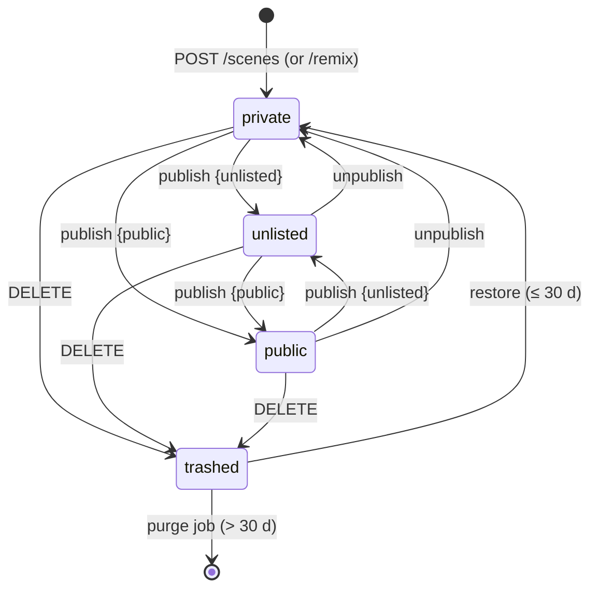

# 05 — Backend Specification

**Status:** Accepted (Session 5, 2026-07-20) — normative for the `api` app and its database
**Implements:** ADR-0004 (backend stack), brief items 6 (database schema) and 7 (API design); makes 01 §4 concrete
**Consumes:** `01-ARCHITECTURE.md` (§4–6), `02-SCENE-FORMAT.md` (limits, validation, meta), `03-SIMULATION-CORE.md` (engineVersion policy, error codes), `04-BUILDER-UX.md` (§10.5 save gate, §11 player/thumbnail/card, §14 autosave), `types/scene.ts`, `types/protocol.ts`, `types/editor.ts`
**Companion files:** `schema.sql` (normative DDL), `openapi.yaml` (normative API contract), `types/api.ts` (DTOs, error codes, route table), `verify-backend.mjs` (consistency suite)
**Consumed by:** M6 (AI endpoint added here later), M7 (social/leaderboards build on these tables), M9 (deployment of exactly this)

---

## 1. Scope and principles

The backend is accounts + persistence + sharing. It never simulates, never renders, and never interprets scene physics beyond the shared validation gate.

1. **One validation gate, shared code.** Every scene document entering the system passes the same `scene-format` package (ajv-compiled `scene.schema.json` + the 02 §8 semantic rules) that the builder runs — ADR-0004's "same language" rationale made real. The server is never more lenient than the client.
2. **Metadata and documents are separate concerns.** Gallery, search, profiles, and lists run entirely on relational columns; the scene document itself is loaded only when someone actually opens a scene. This split is also the object-storage escape hatch (D10).
3. **The document is the source of truth for its own content.** `title`, `description`, `tags`, `durationHint` are *extracted* from `meta` on every save into columns (for search/listing); the API never lets them diverge — there is no "rename without editing the doc" endpoint.
4. **Identity and lineage live outside the document** (ADR-0005 rule 8): owner, timestamps, `remixed_from`, counts are rows, never doc fields.
5. **Stateless API pods.** All state is in Postgres, Redis, and object storage; any pod can serve any request (01 §4).

Out of scope here, by design: likes/comments/follows *endpoints*, leaderboards, challenges, trending ranking (M7 — but their tables are shaped now, §3.5); hosting/CI/observability (M9). The AI generation endpoints landed with M6 on these conventions — normative design in `07-AI-PIPELINE.md`; their surface (two operations, two error codes, rate buckets, Redis state) is registered in §5/§5.2/§8/§9 below.

---

## 2. Scene storage — U3 resolved (D10)

**Decision: Postgres JSONB, with the document in its own `scene_revisions` table — not object storage, and never a column on `scenes`.**

Sizing (why JSONB comfortably wins at MVP scale): the strict writer omits defaults and quantizes to 4 digits (02 §2), so real scenes are small — the 02 §10.1 example is ~0.7 KB; a dense hand-built machine lands ~10–50 KB; the absolute cap is 1 MB raw (`LIMITS.maxJsonBytes`, 02 §7). At 1M scenes × ~3 kept revisions × 30 KB average that is ~90 GB of TOASTed, compressed data — routine for Postgres. Values > 2 KB are TOASTed out of line automatically, so `scenes`-driven list queries never drag document pages through the buffer cache; isolating docs in `scene_revisions` makes that separation structural rather than incidental.

Why JSONB and not `text`/`bytea`: in-database inspection stays possible (migration impact scans — "how many scenes use segmented ropes?" — moderation, corpus building for the CI suite per 02 §9), and TOAST compression applies either way. JSONB normalizes key order and whitespace; that is explicitly fine because **canonical bytes are defined by the strict writer, not by storage** (02 §2), and simulation identity is content-based via DET-4 quantization, not byte-based. Numbers survive exactly: 4-digit decimals are exact in Postgres `numeric`, which is how JSONB stores them.

Why not object storage now: it adds a second consistency domain (DB row ↔ object), a second failure mode on every save, and CDN/cache invalidation on a *mutable* draft object — all to optimize a table that is ~tens of GB at a scale we would celebrate reaching. The API cost profile (ADR-0004) does not need it.

**Revisit triggers (any one):** p95 stored document > 256 KB; `scene_revisions` > 500 GB; JSONB (de)TOAST time visibly in scene-GET p95. **Escape hatch, pre-designed:** because no query outside the scene-load path touches `doc`, the swap is contained to one table — add `doc_key text` (object key) alongside a nullable `doc`, dual-read in the storage module, backfill migration, drop `doc`. No API change, no other table touched.

---

## 3. Data model

Normative DDL in `schema.sql` (PostgreSQL 16; extensions: `citext`, `pg_trgm`, `pgcrypto`). Inventory:

| Table | Purpose |
|---|---|
| `users` | Accounts: handle, email, password hash (null for OAuth-only), verification state |
| `user_identities` | OAuth identities (Google/GitHub), unique per (provider, provider_user_id) |
| `auth_tokens` | Single-use email tokens (verify_email, reset_password): hash, expiry, used_at |
| `sessions` | Server-side sessions: token hash, expiries, device info |
| `scenes` | Scene metadata: owner, extracted meta, visibility, head/published revision pointers, counters, lineage |
| `scene_revisions` | The documents: immutable `(scene_id, rev) → doc jsonb` rows (D10/D11) |
| `likes` | M7-shaped: PK (user_id, scene_id) |
| `comments` | M7-shaped: flat comments with soft delete |
| `follows` | M7-shaped: PK (follower_id, followee_id) |

### 3.1 Identifiers

- **Scene id:** app-generated, 12 chars from `[0-9A-Za-z]` (`API.SCENE_ID_PATTERN`), ≈ 71.4 bits — collision-retried on insert. It is the share URL (`/s/{id}`) and, for unlisted scenes, the capability itself, so it must be unguessable; 71 bits behind rate limits is ample. Distinct from *in-document* ids (02 §2.1), which never leave the document.
- **Handle:** `^[a-z0-9_]{3,20}$` (`citext` unique — case-insensitive, stored as typed), changeable once per 30 days, reserved list in `types/api.ts` (`api`, `admin`, `s`, `explore`, `build`, `me`, …). Public profile URL is `/users/{handle}`.
- **User id:** `uuid` (`gen_random_uuid()`), internal only; handles are the public identifier.

### 3.2 Revisions and the publish model (D11)

Every explicit save appends an **immutable revision**: `scene_revisions (scene_id, rev, doc, schema_version, engine_version, size_bytes, created_at)`, `rev` counting from 1 per scene. Two pointers on `scenes`:

- **`head_rev`** — the latest save; what the owner's builder loads.
- **`published_rev`** — what everyone else sees; set by *publish*, which pins the then-current head.

Consequences, all deliberate: editing after publish never leaks (the public copy changes only on re-publish); "Save" and "Publish" are the two distinct verbs 04 §10.5 asked for; a revision history exists for free (future version picker; not exposed in v1 beyond `?rev=` for the owner); and optimistic concurrency is just an integer (§7).

Both pointers are real (deferred) foreign keys into `scene_revisions` — so the revision-pruning job (keep newest `API.REVISION_KEEP = 20` per scene) **cannot** delete a published or head revision even by bug: the FK refuses.

`schema_version`/`engine_version` are denormalized onto `scenes` (from head) for corpus/ops queries ("what % of scenes are pre-v2?"), and stored per revision as ground truth.

### 3.3 Extracted columns and search

On every save, the gate extracts from the (validated) doc: `title` (default `"Untitled"`, 02 §3), `description` (default `''`), `tags text[]`, `duration_hint`. Search per 01 §4: a stored generated `tsvector` over title + description (GIN), `pg_trgm` GIN on title for typo-tolerant partial match, tags via array containment (GIN). No search engine until these are measurably insufficient.

`duration_s real` is separate: an **advisory, client-reported** last-run duration accepted in the publish payload; the card badge (04 §11.3) renders `coalesce(duration_hint, duration_s)`. It is display data, never trusted for ranking or leaderboards (those are M7 with verification, R2).

### 3.4 Social shaping (M7, tables only)

`likes`, `comments`, `follows` ship in the DDL now (their shapes are stable and `scenes` counter caches reference them) but get **no endpoints until M7**. Counter columns (`like_count`, `comment_count`, `remix_count`) are maintained transactionally with their writes, plus a nightly reconcile job (§9) against ground truth. Deliberately *not* shaped now: challenges and leaderboard entries — their columns depend on M7's anti-cheat design (replay verification, R2/U2); freezing them today would be guessing. Extension point recorded: leaderboard rows will key on `(scene_id, engine_version)` and carry `final_hash` + the metric set from 03 §10.

### 3.5 Integrity the DDL enforces (not just documents)

- `CHECK (visibility = 'private' OR published_rev IS NOT NULL)` — the §4 FSM invariant.
- `CHECK (size_bytes BETWEEN 1 AND 1000000)` on revisions — mirrors `LIMITS.maxJsonBytes` (verified against `types/scene.ts` by `verify-backend.mjs`).
- Scene id and handle pattern CHECKs mirror `types/api.ts` (same verification).
- Lineage: `remixed_from` FK `ON DELETE SET NULL` — purging a scene orphans its remixes' pointers, never the remixes.
- Deferred composite FKs `(id, head_rev)` / `(id, published_rev)` → `scene_revisions(scene_id, rev)` (§3.2).
- `follows` forbids self-follow; token/session secrets are stored only as SHA-256 hashes (`bytea`).

---

## 4. Scene lifecycle: visibility, publish, deletion

### 4.1 State machine (01 §6 made concrete)

Visibility is a tri-state: **private** (default) / **unlisted** (link-only) / **public** (listed in `/explore`).

`publish` requires a verified email (§6.4) and pins `published_rev := head_rev` (re-publish re-pins — that is how edits go live). `unpublish` sets visibility private and **keeps** `published_rev` (one-click re-publish; access control keys off visibility alone). `DELETE` is a soft delete (`deleted_at`), forced private; purge after `API.TRASH_TTL_DAYS = 30` hard-deletes rows + thumbnail object.

### 4.2 Access matrix

| Requester → | owner | signed-in other / anonymous |
|---|---|---|
| private | full: head doc, `?rev=`, save/publish/delete | **404** (not 403 — existence is not leaked) |
| unlisted | full | `GET /scenes/{id}` serves `published_rev` doc; `X-Robots-Tag: noindex`; never listed anywhere |
| public | full | same GET; listed in `/explore` and `/users/{handle}/scenes` |
| trashed | visible via `GET /me/scenes?state=trashed`; restore | 404 |

`GET /scenes/{id}` therefore serves **head** to the owner and **published** to everyone else; the response's `rev` field and `ETag` name whichever revision was served. Remixing (POST `/scenes/{id}/remix`) is allowed to any signed-in user who can read the scene — it copies the **published** doc (head when remixing your own), creates a fresh private scene with `remixed_from` set, and bumps the source's `remix_count`. Remix of unlisted-by-link is intentionally allowed: the link is the capability.

### 4.3 Share pages and embeds

The player page `/s/{id}` (04 §11.1) is served by the web app, which calls `GET /scenes/{id}` server-side for OG metadata (title, author, thumbnail URL) — the API adds no bespoke endpoint. Embed transport constraints are the client's problem (03 §5.3 fallback; U5/M9); the API only guarantees plain cacheable GETs.

---

## 5. API design

Normative contract: `openapi.yaml` (OpenAPI 3.1). Route inventory + auth levels: `ROUTES` in `types/api.ts` (the verify suite holds the three artifacts equal). 27 operations: 11 auth, 10 scene, 2 AI generation (M6 — `07-AI-PIPELINE.md` §2; SSE responses, the spec's only non-JSON 200s besides none), 3 gallery/profile, 1 health.

### 5.1 Conventions

- **Base URL** `https://api.{host}/v1` — the version segment lives in the server URL; paths in the spec are unversioned. Breaking API changes bump `/v1` (independent of `schemaVersion` and `engineVersion` — the three-version rule of 01 §6).
- **Auth** via session cookie (§6.2). Levels in `ROUTES`: `none` / `session` / `owner` (session + resource ownership) / `verified` (owner + verified email).
- **Pagination**: keyset cursors — `?cursor=<opaque>&limit=` (default `API.PAGE_DEFAULT = 24`, max 50); responses `{ items, nextCursor? }`. Cursors encode `(sort key, id)`; offsets are never used.
- **Concurrency**: scene GET returns `ETag: "<rev>"`; `PUT /scenes/{id}` **requires** `If-Match` (`428 E_IF_MATCH_REQUIRED` without it, `412 E_REV_MISMATCH` on stale) — the transport half of the §7 conflict flow.
- **Warnings are data**: scene-writing responses carry `warnings: Finding[]` (the 02 §8 W-rules); the builder surfaces them exactly like its local panel (04 §8.5). Warnings never block a save server-side either.
- **Timestamps** ISO-8601 UTC; **JSON only** (`application/json`), except the thumbnail PUT (`image/webp`).

### 5.2 Error model — one envelope, aligned with the worker

Every non-2xx response is `{ "error": { "code", "message", "details?" } }`. Codes are a **superset of the worker's** (`types/protocol.ts` `SimErrorCode`) so 04 §8.6's copy table extends to API failures with no remapping — a scene rejected by the server reads identically to one rejected by the local gate, with `details.findings: Finding[]` in the same shape the builder's validation panel consumes.

| Code | HTTP | Meaning |
|---|---|---|
| `E_BAD_REQUEST` | 400 | Malformed JSON/params (pre-gate) |
| `E_CREDENTIALS` | 401 | Login failed (never says which half) |
| `E_AUTH_REQUIRED` | 401 | No/expired session |
| `E_EMAIL_UNVERIFIED` | 403 | Verified-email gate (publish) — client offers resend |
| `E_FORBIDDEN` | 403 | Authenticated but not allowed (not owner) |
| `E_QUOTA` | 403 | Account quota exceeded (§8: active scenes cap) |
| `E_NOT_FOUND` | 404 | Missing **or private** (access matrix §4.2) |
| `E_CONFLICT` | 409 | State conflict: handle/email taken, restore of non-trashed, publish of trashed, self-remix rules |
| `E_REV_MISMATCH` | 412 | `If-Match` ≠ current head — §7 conflict flow |
| `E_TOO_LARGE` | 413 | Transport cap: body > 1 MiB / thumbnail > 128 KiB |
| `E_UNSUPPORTED_MEDIA` | 415 | Thumbnail not `image/webp` |
| `E_SCHEMA` | 422 | Gate: JSON Schema failure (findings attached) |
| `E_SEMANTIC` | 422 | Gate: 02 §8 E-rule failure (findings attached) |
| `E_LIMITS` | 422 | Gate: 02 §7 caps (objects/links/raw ≤ 1 MB) |
| `E_SCHEMA_NEWER` | 422 | Doc's `schemaVersion` newer than the server's `scene-format` — deploy lag; client shows 04 §8.6 copy |
| `E_IF_MATCH_REQUIRED` | 428 | Scene PUT without `If-Match` |
| `E_RATE_LIMITED` | 429 | + `Retry-After` and `RateLimit-*` headers (§8) |
| `E_AI_BUDGET` | 429 | Daily AI model-call budget spent (M6, 07 §2.1) — distinct code because the client shows a quota meter, not backoff |
| `E_INTERNAL` | 500 | Our bug; request id in `message` |
| `E_AI_UNAVAILABLE` | 503 | AI upstream down / circuit breaker open / feature unconfigured (M6, 07 §2.1) |

(`E_INTERNAL` is also the worker's crash code — same copy applies. The three-way equality of this table, the `ApiErrorCode` union, and the YAML enum is machine-checked.)

### 5.3 The server-side validation gate (order is normative)

For `POST /scenes`, `PUT /scenes/{id}`, and (M6) the AI pipeline output:

1. **Transport cap:** `Content-Length`/stream > `API.JSON_BODY_CAP_BYTES` (1 MiB) → 413. The gap above the 1 MB document cap exists so rule 3 can *diagnose* an oversized doc rather than drop the connection.
2. **Secure parse:** Fastify's `secure-json-parse` (`__proto__`/`constructor` stripped — scenes are attacker-supplied JSON).
3. **Document caps** (02 §7): raw bytes ≤ 1,000,000, else `E_LIMITS` with findings.
4. **Version switch:** `schemaVersion` newer → `E_SCHEMA_NEWER`; older → run `scene-format` forward migrations (02 §9), then continue; the **migrated** doc is what gets validated and stored (the server stores current-version docs only).
5. **Schema validation:** ajv (2020-12, strict, compiled at boot) → `E_SCHEMA` + findings.
6. **Semantic rules** (02 §8): E-rules → `E_SEMANTIC` + findings; W-rules → collected into the response's `warnings`.
7. **Extraction:** §3.3 columns from `meta`; `size_bytes` = stored serialization length.
8. **Write:** new revision + pointer/extract updates, one transaction.

The engine's `E_LIMITS` for expanded bodies (`MAX_DYNAMIC_BODIES`, 03 §5.4) is *not* re-checked server-side in v1 — it requires expansion, which the API never does. A pathological scene that passes doc caps but exceeds body caps fails in every client at load, uniformly (04 §8.6 copy). Revisit only if abuse appears (then: run the shared expansion counter, no physics, at the gate).

### 5.4 Thumbnails

Client-rendered per 04 §11.2 (640 × 360 WebP), uploaded `PUT /scenes/{id}/thumbnail` as raw `image/webp` ≤ `API.THUMB.maxBytes` (128 KiB — generous: synthetic 640×360 WebP renders land ~15–40 KB). Server checks magic bytes (RIFF/WEBP) + header dimensions == 640×360 (cheap header parse; full re-encode is M9 hardening if abuse warrants). Stored to object storage as `thumbs/{sceneId}/{contentHash8}.webp` (immutable, content-addressed → CDN-cacheable forever, no invalidation); `scenes.thumb_key` swaps atomically; the orphaned object is deleted by the GC job. Uploading is `owner`-level and typically immediately precedes publish; a missing thumbnail renders as a placeholder card, never blocks publish.

### 5.5 Gallery reads

`GET /explore?sort=new&tag=&q=&cursor=` returns card DTOs (04 §11.3 contract: id, title, author ref, thumbnail URL, like count, duration badge value, remix marker, publishedAt). v1 ships `sort=new` only; **M7 adds `trending`/`top` to the same enum and contract** (ranking is a job output, 01 §4 — the endpoint shape doesn't change). `q` searches tsvector + trigram; `tag` filters by containment. All gallery/profile/scene GETs are anonymous-cacheable (`Cache-Control: public, max-age=60` on published content, `private` on owner reads).

---

## 6. Auth (D12)

### 6.1 Model

Email + password **and/or** OAuth (Google, GitHub) per 01 §4 — one `users` row, optionally many `user_identities`. `password_hash` is **argon2id**, m = 64 MiB, t = 3, p = 1 (`API.ARGON2` — OWASP-level; ~50–100 ms per verify, which the login rate limits are sized against). Registration takes `{email, password, handle, displayName?}`, creates the account signed-in-but-unverified, and sends a verification token.

### 6.2 Sessions

Server-side sessions, not JWTs — revocability and simplicity beat statelessness at this scale (and Redis makes the DB read cheap). Token: 256-bit random, stored **only** as SHA-256 in `sessions`; cookie `__Host-ps_sess` — `HttpOnly; Secure; SameSite=Lax; Path=/` (the `__Host-` prefix forbids `Domain`, pinning the cookie to the API origin). Sliding expiry 30 days (`last_seen_at` touch, throttled to 1/hour), absolute cap 180 days. Token **rotates** on login and password change. `POST /auth/logout` deletes the session; `/auth/logout-all` deletes all of the user's sessions (and their Redis cache entries — immediate, not TTL-lagged). Redis read-through cache (token-hash → session, TTL 5 min) keeps the per-request cost at one Redis GET.

### 6.3 OAuth

Authorization-code + PKCE; `state` in a short-lived cookie. On callback: existing identity → sign in. New identity: **auto-link to an existing account by email only when the provider asserts the email is verified** (Google `email_verified`, GitHub primary verified email) — unverified provider emails are an account-takeover vector, so those get a "sign in with your password to link" interstitial instead. No matching account → create one (handle prompted client-side, `E_CONFLICT` on collision; OAuth-created accounts count as email-verified). Identities can be linked/unlinked from settings (M7 profile UI; unlink refuses to strand a password-less account).

### 6.4 Verified-email gates

Unverified accounts can: use the full builder, save private scenes, remix. They cannot: **publish** (`E_EMAIL_UNVERIFIED`) — and, come M7, comment/like. This keeps the abuse surface (public content, spam) behind a working mailbox while never blocking creation. Tokens: `auth_tokens` rows, SHA-256-hashed, single-use, verify = 24 h expiry, reset = 1 h; password reset consumes all sessions (rotation) and responds `202` regardless of account existence (no enumeration; same rule as `E_CREDENTIALS`).

### 6.5 Anonymous → account upgrade (04 §14 tie-in)

Logged-out building is fully local: the draft lives in IndexedDB (autosave ring, `EDITOR.AUTOSAVE_RING = 5`). The **first save** triggers the auth dialog; after signup/login (including the OAuth redirect round-trip — IndexedDB survives it, which is why the draft is *not* in memory/sessionStorage), the client `POST /scenes` the draft. The server holds zero anonymous state; there is nothing to migrate or expire.

### 6.6 CSRF and browser hygiene

`SameSite=Lax` plus a server-side **Origin check**: unsafe-method requests bearing the session cookie must present an allowlisted `Origin` (absent or foreign → 403 `E_FORBIDDEN`). JSON-only bodies close the form-post hole. CORS: credentialed, allowlisted app origins only. Personal-access tokens for third-party API use are deliberately post-MVP (noted for M11's public-API story); until then the cookie is the only credential.

---

## 7. Autosave, drafts, and save conflicts (the 04 §14 "sync semantics")

Local autosave is the crash net; the server sees only explicit saves. Concretely:

- Local ring entry: `{ sceneId | null, baseRev, doc, savedAt }` every 30 s + on blur (`EDITOR.AUTOSAVE_*`).
- **Explicit save**: new scene → `POST /scenes`; existing → `PUT` with `If-Match: baseRev`. Success returns the new `rev` → becomes `baseRev`, save-pointer updates (04 §9), local entries for the scene are pruned.
- **On open** of `/build/{id}`: `GET` head (`rev`), then compare any newer-than-server local entry:
  - `entry.baseRev == rev` → same lineage, just unsaved: **"Restore unsaved changes?"** (restore → dirty editor at `baseRev`; discard → drop entry).
  - `entry.baseRev < rev` → edited elsewhere meanwhile: conflict dialog — *keep server* (drop entry) / *save mine as copy* (`POST` → new scene) / *overwrite* (explicit, re-`PUT` with current rev).
- **On 412 at save time**: same three-way dialog (someone saved from another tab/device since load).

No merge is attempted, ever — scene JSON merge semantics are undefined and silently wrong merges destroy machines. Fork-on-conflict is the honest operation. **Server-side draft storage (cross-device continue-editing) is deliberately deferred** — it is a sync feature with real conflict UX cost, and M10's collaboration design should own it coherently → **U13**.

---

## 8. Rate limits, quotas, abuse caps

Redis token buckets (`@fastify/rate-limit` + redis store), keyed per-IP (anonymous) / per-user (authed); 429 + `Retry-After` + IETF `RateLimit-*` headers. Normative table in `types/api.ts` (`RATE_LIMITS`); highlights:

| Bucket | Limit |
|---|---|
| Public GETs (gallery, scenes, profiles) | 300/min per IP |
| Login | 10 / 15 min per IP **and** 10 / h per account (argon2 cost shield) |
| Register | 5 / h per IP |
| Password-reset request / resend-verification | 5 / h per IP; 3 / day per account |
| Scene create | 30 / h, 200 / day per user |
| Scene save (PUT) | 60 / 10 min per user (manual saves only — autosave is local) |
| Publish / remix / thumbnail / delete | 30 / day · 60 / day · 60 / day · 60 / day per user |
| AI generation (M6, 07 §7.3) | 3 / min burst; **20 model calls / day** per user (generate + each repair debit one; exhaustion = `E_AI_BUDGET`); 1 concurrent generation (Redis lock, `E_CONFLICT`) |

Quotas: `API.MAX_ACTIVE_SCENES = 500` non-trashed scenes per user (`E_QUOTA`; doubles as the procgen-spam ceiling) — with ≤ 20 kept revisions × ≤ 1 MB this bounds worst-case per-user storage at a known number. Body caps per §5.3/§5.4. All social-write buckets (M7) reserve names now in `RATE_LIMITS` so abuse posture is designed before the features land (ADR-0004 consequence).

---

## 9. Redis and background jobs

**Redis** (01 §4): session cache (§6.2), rate buckets (§8), M6 AI per-generation transcripts + concurrency locks (07 §2.2 — TTL 600 s, size-capped, disposable by design), M7 trending zsets later. Nothing in Redis is ever the only copy of anything (a lost AI transcript just ends that generation).

**BullMQ jobs** (ADR-0004): `purge-trash` (hard-delete soft-deleted scenes/users > 30 d; lineage FKs SET NULL); `prune-revisions` (keep newest 20 per scene; FKs protect head/published, §3.2); `thumb-gc` (orphaned objects after key swaps, §5.4); `token-sweep` (expired `auth_tokens`, `sessions`); `counter-reconcile` (nightly: recompute `like_count`/`comment_count`/`remix_count` from truth, alert on drift); M7 adds `trending-recompute` here.

---

## 10. Verification

`verify-backend.mjs` (run per the repo convention: copy companions to a scratch dir, `npm i`, `node verify-backend.mjs`) holds the four artifacts mutually consistent — it fails on any of:

1. `openapi.yaml` invalid against the OpenAPI 3.1 meta-schema (`@seriousme/openapi-schema-validator`).
2. Any operation missing `operationId`/`tags`/`summary`; any ≥ 400 response not using the shared error envelope; any undeclared path parameter.
3. `ROUTES` (`types/api.ts`) ≠ the spec's operation set (id, method, path — both directions).
4. Error-code set inequality between `ApiErrorCode` (api.ts), the YAML `code` enum, and the §5.2 table — including per-code HTTP status (api.ts `ERROR_STATUS` vs this doc).
5. Any example scene document embedded in `openapi.yaml` failing the real `scene.schema.json` (ajv 2020 strict — API examples can never drift from the format).
6. `schema.sql` failing the **real PostgreSQL parser** (`pgsql-parser`, libpg_query); table set ≠ the §3 inventory; the revision `size_bytes` CHECK ≠ `LIMITS.maxJsonBytes`; DDL id/handle patterns ≠ `types/api.ts`.
7. `types/api.ts` additionally compiles under `tsc --strict --exactOptionalPropertyTypes --noUncheckedIndexedAccess` with its cross-file ties (`Scene` doc typing, `SimErrorCode ⊆ ApiErrorCode`, thumbnail dims === `EDITOR.THUMB_W/H` at the type level).

---

## 11. Decisions made in this milestone

1. **D10 — scene storage (U3 resolved):** Postgres JSONB in a dedicated `scene_revisions` table; metadata/document separation structural; object-storage escape hatch pre-designed with explicit revisit triggers (§2).
2. **D11 — revision + publish model:** immutable per-save revisions; `head_rev` vs `published_rev` pointers; publish pins, unpublish keeps the pin; tri-state visibility with the DDL-enforced invariant; ETag/If-Match concurrency; keep-20 pruning FK-protected (§3.2, §4).
3. **D12 — auth:** DB sessions + `__Host-` cookie (no JWTs), argon2id, PKCE OAuth with verified-email-only auto-linking, verified-email publish gate, zero server-side anonymous state, Origin-check CSRF (§6).
4. Minor, recorded: scene ids = 12-char base62 capability URLs (§3.1); no-merge conflict policy with fork-on-conflict (§7); `E_*` API codes as a strict superset of worker codes (§5.2); advisory `duration_s` never feeds ranking (§3.3); thumbnails content-addressed + GC'd (§5.4).

---

## 12. Open questions raised here (carried in 00-PROGRESS.md)

- **U13:** server-side drafts / cross-device continue-editing deferred (local-only autosave for MVP) — design belongs to the M10 collaboration model (same conflict machinery).
- **U14:** external vendor selection — object storage/CDN and transactional email provider (+ SPF/DKIM, deliverability). Abstracted behind modules here; concrete picks in M9.
- **U15:** account deletion & data-export compliance flow (GDPR-shaped: what happens to public scenes and remix lineage on erasure — likely: scenes purge, lineage pointers null, remixes survive). Decide before public launch → M9 (jobs exist; policy pending).
