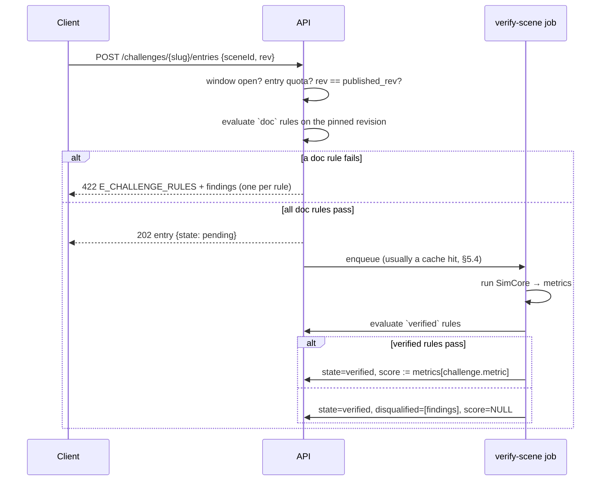

# 08 — Community, Challenges, and Leaderboards

**Status:** Accepted (Session 8, 2026-07-20) — normative for the social surface, the ranking job, the verification worker, and the moderation flow
**Implements:** the brief's community section; resolves **U2 / R1-era risk R2** (forgeable client metrics)
**Consumes:** `01-ARCHITECTURE.md` (§3.3 data flow, §4 backend shape, §6 versioning, R2), `02-SCENE-FORMAT.md` (documents describe inputs only), `03-SIMULATION-CORE.md` (§1 environment-free SimCore, §9 finish conditions, §10 analytics, §12 state hash), `04-BUILDER-UX.md` (§11 player/card contract), `05-BACKEND.md` (all of it — this milestone adds to that surface, it does not fork it), `06-PROCGEN.md` (§8 check harness), `07-AI-PIPELINE.md` (§7.1 deferred moderation note)
**Companion files:** `schema.sql` (five new tables + M7 columns), `openapi.yaml` (18 new operations), `types/community.ts`, `types/api.ts` (codes, routes, buckets), `verify-backend.mjs` (M7 block)
**Consumed by:** M8 (ranking/read-path performance), M9 (moderator tooling, verification capacity, U9 dashboard), M10 (monetization ties to challenges), M11 (roadmap)

---

## 1. Scope and principles

This milestone turns a single-player builder with share links into a place with other people in it: likes, comments, follows, a ranked gallery, remix lineage you can walk, staff-run challenges, and leaderboards that are worth trusting.

1. **Nothing here touches the document.** No social, ranking, or challenge state ever enters a scene document (ADR-0005 rule 8, restated in 05 §1.4). A scene that wins a challenge is byte-identical to the same scene before it was entered.
2. **Ranking inputs are server-computed or server-counted — never client-asserted.** Metrics come from our own simulation run (§5); counts come from rows we insert. There is no number in this system that a client can simply state and have believed.
3. **Prefer removing the cheat surface to policing it.** A run is a pure function of the document (§5.1), so leaderboards are recomputed rather than defended. U2's "replay-verification of *suspicious* entries" turns out to be the wrong shape: verify everything cheap, refuse to rank what is expensive.
4. **Humans decide moderation; machines only assist.** The report channel can *limit* reach automatically; nothing is ever auto-removed (§7).
5. **Every social write is idempotent, transactionally counted, and rate-limited by a bucket that already existed.** M4 reserved `like`/`comment`/`follow` before the features existed (05 §8); they went live in this milestone unchanged.

Out of scope, deliberately: user-authored challenges (§12 U23), direct messaging, notifications beyond in-app counts, prizes/monetization (M10), moderator tooling and policy text (M9), personalized recommendation (nothing here learns a user model).

---

## 2. Social surface

### 2.1 Likes

`POST /scenes/{id}/like` · `DELETE /scenes/{id}/like`, both **idempotent** — the primary key `(user_id, scene_id)` is the whole implementation. Requires a session, *not* a verified email: liking is the cheapest way for a new account to participate and the damage ceiling is a counter. Self-likes are allowed (they are how people bookmark their own work) and are simply not counted for ranking (§4.3).

The response is the scene's `SceneSocial` block — the counters plus `viewerLiked` — so the client never has to guess what its own click did.

### 2.2 Counters and integrity

`scenes.like_count` / `comment_count` / `remix_count` and `users.follower_count` / `following_count` are caches, written in the **same transaction** as the row they count. Three defenses, in order of cost:

| Defense | Mechanism |
|---|---|
| Correct by construction | PK/unique constraints make double-counting impossible (a second like is an upsert no-op, not a second row) |
| Nightly repair | `counter-reconcile` (05 §9) recomputes every counter from ground truth and **alerts on any drift** — drift means a code path skipped the transaction |
| Ranking independence | The ranking job reads the *rows* (with eligibility filters), never the cached counters — so a poisoned counter can inflate a badge but not a rank |

Redis holds the trending zsets and nothing else social. Losing Redis costs one ranking cycle.

### 2.3 Comments

Flat, no threading, `SOCIAL.COMMENT_MAX_CHARS` = 1000, plain text (no markup rendering — §7.1). Threads close at `COMMENT_MAX_PER_SCENE` = 500 with `E_CONFLICT`; at that point the conversation is not the product.

- **Posting requires a verified email** (the same gate as publish, 05 §6.4). Comments are the platform's cheapest abuse surface — free text, high visibility — and the verification gate is the strongest cheap filter we have.
- **No editing.** Deliberate: an edit after replies rewrites the context of a conversation, and every moderation system that allows it needs edit history to stay honest. Delete-and-repost is the v1 answer.
- **Deletion leaves a tombstone** (`removed: true`, empty body) so replies to it don't dangle. The comment author *and* the scene's owner may delete; the owner's power stops at their own scene's thread.

### 2.4 Follows

`POST`/`DELETE /users/{handle}/follow`, idempotent, PK `(follower_id, followee_id)`, self-follow refused by the DDL (`follows_no_self`). Ceiling `SOCIAL.MAX_FOLLOWING` = 5000 — a follow-spam limit, not a social one. Follower lists are public; there are no private accounts in v1 (everything publishable is already public or link-capability).

### 2.5 The following feed

`GET /explore?sort=following` — scenes published by accounts you follow within `SOCIAL.FEED_WINDOW_DAYS` = 30, newest first, keyset-paged like every other listing. It is a **query, not a fan-out**: a join over `follows` → `scenes (published_at DESC)`, both indexed. At MVP scale (≤ 5 000 follows, an indexed range scan per page) this is a millisecond-class query, and it has no write amplification, no per-user materialized timeline to invalidate, and no consistency window.

Revisit trigger (documented so the swap isn't a surprise): p95 feed latency > 150 ms, or the median followee set exceeding ~2 000 active authors. The fix at that point is a materialized timeline for heavy followers only — M8's problem, not the API's (the endpoint shape is unchanged either way).

---

## 3. Remix lineage

`GET /scenes/{id}/remixes` returns the scene's **ancestors** (walked up `remixed_from`, ≤ `LINEAGE.MAX_ANCESTORS` = 20, root first), the scene itself, and a page of **direct children**. Cycles are impossible by construction: a remix always creates a *new* scene pointing at an *existing* one.

- `childCount` is `scenes.remix_count` — direct remixes only. Deeper descendant totals are not maintained; a recursive count is unbounded work for a decoration, and the ancestors walk already gives credit where it is due.
- Any node the requester cannot read (private, purged, moderated) is returned as `unavailable: true` with placeholder title/author. The chain never appears broken and never leaks what it is hiding — the same instinct as 05 §4.2's 404-not-403 rule.
- `remixed_from` is `ON DELETE SET NULL` (05 §3.5), so purging an ancestor detaches the chain instead of cascading it. A remix outlives its parent; a lineage view of it starts at the null.

Cards already carry the remix marker (04 §11.3), so lineage needs no card-contract change — this endpoint powers the player page's "remixed from / remixes" panel.

---

## 4. Explore ranking

### 4.1 Modes

`GET /explore?sort=` takes `new | trending | top | following` — the M4 enum extended, contract unchanged (05 §5.5 promised exactly this). `EXPLORE_SORTS` in `types/community.ts` and the spec's enum are held equal by the verify suite.

| Mode | Order | Cacheable |
|---|---|---|
| `new` | `published_at DESC` | public, 60 s |
| `trending` | `rank_score DESC` (§4.2) | public, 60 s |
| `top` | all-time eligible likes, `≥ TRENDING.TOP_MIN_LIKES` (3) | public, 60 s |
| `following` | §2.5 | `private` — per-user |

### 4.2 The trending score

Pinned by `RANKING_VERSION`; changing the formula or its weights is a version bump, which is also how we compare before/after in telemetry.

```
score = (likes + W_REMIX·remixes + W_COMMENT·comments) / (ageHours + OFFSET_H)^GRAVITY
      = (likes + 3·remixes + 1·comments) / (ageHours + 2)^1.5
```

**A remix is worth three likes** because it is the platform's real engagement signal: someone opened the machine, understood it, and built on it. Comments are worth one; likes are the unit.

The `trending-recompute` job (BullMQ, every `TRENDING.RECOMPUTE_S` = 600 s) scores every public, `visible`, verified-or-unranked scene published within `WINDOW_DAYS` = 14, writes the top `ZSET_SIZE` = 1000 into a Redis zset for hot reads, and persists `scenes.rank_score` / `ranked_at` so a cold Redis serves from Postgres (`idx_scenes_rank`) until the next cycle.

Cadence is justified, not guessed: the §9 spike measured **~3% score drift per 10 minutes** at age 6 h with no new engagement — well under the resolution anyone perceives in a card grid.

### 4.3 Ranking eligibility (the anti-manipulation half)

Counters count everything; **ranking counts less**. A signal contributes to `trending`/`top` only if:

1. the actor's email is verified, **and**
2. the actor's account is older than `SOCIAL.RANK_MIN_ACCOUNT_AGE_H` = 24 h, **and**
3. the actor is not the scene's owner, **and**
4. the scene is `public` and `moderation_state = 'visible'`.

Rules 1–2 make sock-puppet rings cost a day and a mailbox each, which is the right price point for a hobby platform (harder screens — device fingerprints, graph clustering — buy little here and cost privacy). Rule 3 kills self-promotion loops. Rule 4 is how a `limited` moderation state actually bites (§7.3).

The spike checked the property that matters for a gallery worth revisiting: **the shelf churns**. A fresh scene with 5 likes, 1 remix, 2 comments outranks a week-old scene with 400 likes, 20 remixes, 60 comments (1.93 vs 0.24) — age wins over accumulated fame, so the front page is never a museum.

### 4.4 `top`

All-time eligible likes, minimum 3, `visible` only. It exists so that "the best thing here" is findable without competing with recency, and the floor of 3 keeps the tail of one-like scenes out of an arbitrary ordering. It is deliberately **not** a leaderboard — leaderboards rank *verified physics*, `top` ranks *popularity*, and conflating them is how communities learn to distrust both.

---

## 5. Verification — U2 and R2 resolved (D17)

### 5.1 The argument

01 §3.5 and R2 assumed leaderboard entries would arrive as client-computed metrics that we would have to defend against forgery — with "replay-verify suspicious entries in Node" as the mitigation. Working through it in this milestone, the premise is wrong in a way that makes the whole problem disappear:

1. **Documents describe inputs, never results** (ADR-0005, D5). Everything the run depends on — geometry, materials, seed, world settings — is in the document.
2. **There is no player input during a run.** The builder is read-only in play mode (01 §3.3 rule 2); the worker's commands are `play`/`pause`/`setSpeed`/`reset`, and DET-8 requires commands to apply on step boundaries only, so pacing cannot leak into state (03 §5.2, verified by the command-boundary test in 03 §12).
3. **The engine is deterministic and pinned** (D7, DET-1…DET-11): fixed 60 Hz, stable construction order, quantized inputs, one PCG32, transcendentals load-time only.

Therefore the metric set is a **pure function of `(document, engineVersion)`**. A leaderboard entry is not a performance to be judged; it is a property of a document that anyone — including us — can recompute.

**So we recompute.** The server runs the scene in its own headless SimCore (03 §1 rule 1: the same environment-free package the browser worker uses) and ranks *its own* numbers. There is nothing to forge, no spot-check sampling rate to tune, no appeal process for a cheating accusation — because the client is never asked for a number in the first place.

The spike confirmed the two properties this rests on (§9): three **separate Node processes** produced byte-identical hashes and metrics for the same documents, and reordering a document's `objects[]` array — which is exactly what a JSONB round-trip is permitted to do to key order (05 §2) — changed nothing, because DET-3 constructs bodies in sorted id order.

> Consequence worth stating plainly: **leaderboards rank machines, not play sessions.** That is a better fit for the product than a score-attack framing anyway — the thing being judged is the thing the user built.

### 5.2 What the server computes

One `verify-scene` run produces the engine's own `AnalyticsReport` (03 §10) plus the `finalHash` (03 §12), stored in `scene_verifications.metrics` as-is. Challenges may rank by any of six fields, which `types/community.ts` compile-proves to be numeric members of that report (and the verify suite re-checks against `types/protocol.ts`):

| Metric | `better` | Reads as |
|---|---|---|
| `durationS` | min | fastest machine |
| `objectsActivated` | max | most of the build actually used |
| `chainReactions` | max | most causal edges |
| `longestChain` | max | deepest single chain |
| `maxSpeedMS` | max | fastest thing on the table |
| `efficiencyScore` | max | 03 §10's composite |

`efficiencyScore`'s formula is provisional (03 §10) but **engineVersion-scoped**, which is what keeps a board internally comparable (§6.4).

### 5.3 The `verify-scene` job

BullMQ, `VERIFY.WORKER_CONCURRENCY` = 2 per pod (each run is single-threaded and CPU-bound; two per pod leaves headroom for the API). Enqueued on:

- **publish** (so a scene has authoritative metrics before anyone can rank it), and
- **challenge entry** (which usually hits the cache — see §5.4), and
- **re-check**: entries in an open challenge older than `VERIFY.RECHECK_DAYS` = 7, so a verifier bump can't leave a stale board.

The worker loads the document from `scene_revisions`, expands and steps it exactly as a player would, and writes one row. It never renders, never networks, and imports no browser shim — that is the entire reason 03 §1 rule 1 exists.

### 5.4 The cache key

`UNIQUE (doc_hash, engine_version, verifier_version)` where `doc_hash` is SHA-256 of the canonical serialization (02 §2 strict writer), stored on every revision. Because the result is a pure function of that triple, **the cache is permanent** — no TTL, no invalidation logic. Consequences:

- A remix that changes nothing verifies in zero runs.
- Re-saving a scene without touching the machine (a title edit changes `meta`, so that *is* a new document — the strict writer includes it) is the only surprise, and it costs one run.
- `VERIFIER_VERSION` is the escape hatch: a SimCore change *inside* the same `engineVersion` bumps it and re-verifies everything lazily, without touching a single stored document.

### 5.5 Budgets, and the `unranked` state

Verification is cheap for real scenes and expensive for pathological ones, so it is budgeted rather than unbounded. From the §9 measurements: a 120-domino chain reaction — geometry, contacts, sensors, a full finish condition — verifies in **88 ms**. The cost curve is dominated by *simultaneous contacts*, not object count: a 250-body scene runs at ~17 500 steps/s, while a 500-body scene that is one settling pile drops to ~1 200 steps/s, and 5 000 bodies to ~68 steps/s (≈ 9 minutes for a full 600 s run).

| Budget | Value | Meaning |
|---|---|---|
| `VERIFY.STEP_BUDGET` | `SIM.HARD_CAP_S × 60` = 36 000 | Verification is never shorter than a legal run (suite-enforced) |
| `VERIFY.BODY_BUDGET` | 1 500 dynamic bodies | Above this a scene is `unranked` — it still plays, publishes, and gets liked |
| `VERIFY.WALL_BUDGET_MS` | 20 000 | Kill switch; the outcome is `unranked`, never `failed` |

`VERIFY.COST_MODEL` (the measured steps/s table) is used by `predictVerifyMs()` at **enqueue** time, so an over-budget scene is marked `unranked` without first burning 9 minutes of CPU to discover it.

The four states, and what each means to a user:

| State | Cause | Effect |
|---|---|---|
| `pending` | queued | Board shows "verifying" |
| `verified` | ran inside budget | Metrics are authoritative; rankable |
| `unranked` | legal but over budget | Publishable, likeable, remixable — never ranked, with the reason shown to the owner |
| `failed` | did not load/finish in the verifier | Reported to the owner as a bug (ours or the document's); never ranked |

`unranked` is the honest answer to "what if someone submits a 5 000-domino monster": we do not accuse, we do not silently drop it, and we do not spend nine CPU-minutes per entry. Cost at realistic volume is negligible — at 10 000 publishes/day of typical scenes (~0.1 s each) verification is ~17 CPU-minutes/day.

### 5.6 Client run reports (advisory only)

`POST /scenes/{id}/runs` accepts what the player's own worker computed: `engineVersion`, `finalHash`, its `AnalyticsReport`, and a coarse platform bucket. The server **ranks nothing from it**. It records one thing: whether the client's `finalHash` matched our verification's.

That comparison is the standing production signal for **U9** (cross-platform determinism — the browser triple vs. our Node build). A mismatch is an *engine incident*, opened against us, never an accusation against the user; `idx_run_reports_divergence` is the dashboard query. Anonymous players may post (the endpoint is IP-bucketed) because divergence data from machines we don't own is exactly the data we lack.

This is what 01 §3.5's "client-signed leaderboard submission" turned into once ranking stopped needing it: telemetry.

### 5.7 What this does and does not prevent

| Threat | Status |
|---|---|
| Forged metrics / patched client / replayed submission | **Impossible by construction** — the client's numbers are never an input to ranking (§5.1) |
| Modified engine build locally | Irrelevant — we recompute with ours |
| CPU exhaustion via pathological entries | Budgeted (§5.5) + `challengeEntry` quota (20/day) |
| Vote manipulation (sock puppets) | Priced, not eliminated: §4.3 eligibility |
| Spam entries / scene flooding | `API.MAX_ACTIVE_SCENES`, publish + entry buckets (05 §8) |
| Offensive content in titles/comments | §7 — a policy problem, not a physics one |
| Platform divergence making a hash mismatch | §5.6 → U9; ranking is unaffected because only our number ranks |
| A scene that is *legitimately* better because it is huge | Accepted: it wins `top`, it cannot win a board (unranked). Challenges cap object counts anyway (§6.2) |

---

## 6. Challenges and leaderboards (D18)

### 6.1 Shape and authorship

A challenge is **a brief, a machine-checkable rule set, one ranking metric, one engine version, and a time window**. Staff-authored in v1 — user-authored challenges need their own moderation and spam design (U23). `challenges.state`: `draft → open → judging → closed`.

Entries are scenes, one per user (`UNIQUE (challenge_id, user_id)`), pinned to an exact revision (`FOREIGN KEY (scene_id, rev) REFERENCES scene_revisions`) so that **editing a scene after entering cannot move a ranking**. Re-entering replaces your entry; withdrawing is allowed while the challenge is open.

### 6.2 The rule vocabulary

Twelve rule kinds, a closed union (`ChallengeRule`, `types/community.ts`), each rendering as one line of the brief and, on failure, one `ApiFinding` in the builder's validation-panel shape. Never free-form code; never anything a client self-reports.

| Rule | Decided from | Example use |
|---|---|---|
| `maxObjects` / `minObjects` | document | "under 30 pieces" |
| `allowedTypes` / `forbiddenTypes` / `requiredTypes` | document | "no fans", "must use a lever" |
| `maxLinks` | document | keep contraptions simple |
| `requireGoal` | document | there must be something to reach |
| `planeAngleRange` | document | fix the table tilt |
| `startFromScene` | document | remix-this-machine challenges (lineage check) |
| `requireSuccess` | **verified run** | the goal must actually be reached |
| `maxDurationS` / `minDurationS` | **verified run** | "finish under 10 seconds" |

The `doc` / `verified` split is a table in code (`CHALLENGE_RULE_SOURCE`, exhaustive over the union) because it drives the entry flow's two-phase answer.

### 6.3 Entry flow



The DDL keeps this honest: `entry_score_iff_verified` makes "ranked" and "has a score" the same thing, so a bug cannot produce a ranked entry with no verified number behind it.

Ties break by earlier `created_at`, then scene id — deterministic, and it rewards getting there first.

### 6.4 Comparability: one engine version per board

`challenges.engine_version` is the build every entry is verified with. Metric definitions are part of the determinism surface (03 §10), so a board that mixed engine versions would be comparing different measurements — 01 §6's three-version rule made concrete. A document recording a **newer** `engineVersion` than the challenge is refused (`E_CONFLICT`): it may use features the pinned build cannot expand. Older documents are fine — they migrate forward through the same gate as everything else (05 §5.3 rule 4).

### 6.5 Closing

`challenge-close` (BullMQ) moves `open → judging` at `closes_at`, lets in-flight verifications drain for `CHALLENGE.CLOSE_GRACE_H` = 6 h (nobody loses a placement to our queue depth), then `judging → closed`, after which entries and scores are immutable. Withdrawal is refused once judging starts.

Winners are displayed on the board; prizes, badges, and any economy around them are M10's call — this milestone deliberately ships the mechanism without the incentive.

---

## 7. Moderation and reporting (D19)

### 7.1 Posture

- **Scenes are data, never code** (01 §6), and comments/titles render as plain text — so moderation here is about *content*, not execution safety.
- **AI-generated text is the author's content.** 07 §7.1 deferred this: generated `meta.title/description/tags` are moderated exactly like hand-typed ones, through the surface below. No AI-specific machinery — closing that note is one of this milestone's jobs.
- **Nothing is auto-removed.** The automated path can only *limit* (delist), which is reversible and invisible in its effects to everyone but ranking.

### 7.2 Reports

`POST /reports` over `{ targetType: scene|comment|user, targetId, reason, note? }` with seven reasons (`REPORT_REASONS`, held equal across DDL/TS/YAML). One open report per (reporter, target) — enforced by `UNIQUE NULLS NOT DISTINCT`, so a duplicate is a 409, not a second row. `MODERATION.MAX_REPORTS_PER_DAY` = 20 per user (the `report` bucket, kept numerically equal to the constant by the verify suite) because the abuse channel is itself an abuse surface.

At `MODERATION.AUTO_LIMIT_REPORTS` = 5 **distinct** reporters, a scene is auto-limited pending human review. The response never tells the reporter what happened to the target — outcome disclosure is how reporting becomes harassment.

The moderator queue itself (`content_reports.state`: `open → actioned|dismissed`) is an internal tool: M9 (U22).

### 7.3 States and their effects

| | `visible` | `limited` | `removed` |
|---|---|---|---|
| `/explore`, search, feeds | yes | **no** | no |
| Direct link `/s/{id}` | yes | **yes** | no (owner only) |
| Ranking signals (§4.3) | counted | **not counted** | not counted |
| Remixable | yes | yes | no |
| Comments | open | open | closed |
| Challenge entries | eligible | eligible | withdrawn |
| Owner sees | normal | normal + notice | reason + appeal, `E_MODERATED` |

Everyone other than the owner gets a plain `404` for a `removed` item — the 05 §4.2 instinct again: existence is not leaked. Only the owner ever sees `E_MODERATED` (403), because only the owner already knows the thing exists.

`limited` is the state that makes the automated path safe: it costs reach, not access, and it is a single column flip to undo.

### 7.4 Appeals and retention

`removed` items are retained for `MODERATION.APPEAL_WINDOW_DAYS` = 30, then purged by the existing `purge-trash` job. Suspended accounts (`users.moderation_state = 'removed'`) have their public content delisted, not deleted — remix lineage that points at it survives as `unavailable` nodes (§3), which is the same treatment account deletion will need when U15 is decided in M9.

---

## 8. Registration in the M4 surface

M7 adds no new architecture — it extends the tables, codes, buckets, and jobs that 05 established.

### 8.1 Tables

<!-- table-inventory -->

| Table | Purpose |
|---|---|
| `scene_verifications` | Server-computed run results, keyed by (doc_hash, engine_version, verifier_version) — §5.4 |
| `run_reports` | Advisory client analytics + hash agreement; the U9 divergence signal — §5.6 |
| `challenges` | Brief, rule set, ranking metric, engine version, window — §6.1 |
| `challenge_entries` | One pinned scene revision per user per challenge, with its verified score — §6.3 |
| `content_reports` | User abuse reports, one open per (reporter, target) — §7.2 |

Columns added to existing tables: `scenes.rank_score/ranked_at/moderation_state/moderated_at/moderation_reason`, `scene_revisions.doc_hash`, `users.follower_count/following_count/moderation_state`, `comments.moderation_state` (with a CHECK forbidding `limited` — there is nothing to delist a comment from).

### 8.2 Error codes

`E_CHALLENGE_RULES` (422, findings attached) and `E_MODERATED` (403, owner-only) join the 05 §5.2 table — 22 codes, still three-way checked.

### 8.3 Rate buckets

`like` 500/day · `comment` 100/day · `follow` 200/day (all reserved in M4, now live) · `challengeEntry` 20/day · `report` 20/day · `runReport` 120/h per IP.

### 8.4 Jobs

`verify-scene` (§5.3 — the only CPU-heavy job we own), `trending-recompute` (§4.2), `challenge-close` (§6.5), plus `counter-reconcile` extended to the new counters.

---

## 9. Spike record (2026-07-20, Session 8)

Environment: darwin-arm64, Node 24, `@dimforge/rapier2d-deterministic-compat@0.19.3` (the D7 build), scratchpad only (not committed — S3 precedent). Mini-expansion per 03 §6 for platform/ramp/domino/marble/crate/goal with 02 material defaults, FNV-1a 32 state hash per 03 §12. As in S6, the numbers are estimates to be re-measured on the real SimCore (**U20**); the design conclusions do not depend on their precision.

| Experiment | Result |
|---|---|
| **E1 cross-process determinism** | 3 **separate Node processes**, 3 scenes (40-domino chain, 120-domino chain, 200-crate pile): identical hashes and identical metrics, byte-for-byte. This is the property server-side verification needs and that S3's same-process double-run did not establish |
| **E2 storage-order independence** | Reversing + rotating `objects[]` (what a JSONB round-trip may do to ordering, 05 §2) → identical hash `5de2a1f1` and identical metrics — DET-3's sorted construction carries the claim |
| **E3 cost curve** (600 steps per size, crate pile = worst case, all contacts live) | 25 bodies 62 k steps/s · 100 → 41 k · 250 → 17.5 k · 500 → 1.2 k · 1 000 → 548 · 2 500 → 173 · 5 000 → 68. The knee is *simultaneous contacts*, not body count |
| **E4 realistic scene** | 120-domino chain reaction with ramp, marble, sensors, run to its finish condition: 738 steps (12.3 s simulated) in **88 ms** wall → verification is ~140× real time for real machines |
| **E5 trending decay** | G = 1.5, offset 2 h: half-life 1.2 h at publish, 4.7 h at age 6 h, 15.3 h at a day; fresh 5-like scene 1.93 > week-old 400-like scene 0.24 (churn holds); **3.05% score drift per 10 min** at age 6 h → `RECOMPUTE_S` 600 |
| **E6 forgery** | A fabricated report (`durationS: 999`, `objectsActivated: 9999`) against a server recomputation from the document alone (6.15 s, 61) — the detection is not a heuristic, it is the same function run twice |

E1 + E2 are what license D17: the server's number is reproducible and independent of how we stored the document. E3 + E4 are what license the budget design (§5.5) — cheap for real scenes, pathological for piles, so *predict then rank* rather than *run then discover*.

---

## 10. Verification

`verify-backend.mjs` gained an M7 block (run per the repo convention: copy companions — now including `08-COMMUNITY.md`, `types/community.ts`, `types/protocol.ts` — into a scratch dir, `npm i`, `node verify-backend.mjs`). It fails on any of:

1. Table inventory ≠ `schema.sql`, where the inventory is now **05 §3 ∪ 08 §8.1** (the 08 block is marker-scoped, so a rate-bucket row can't smuggle a table name in).
2. Enum label-set inequality across DDL / `types/community.ts` / `openapi.yaml` for verification states, challenge states, and report reasons; DDL ↔ TS for moderation states.
3. Ranking-metric inequality across the three artifacts, **or** any ranking metric that is not a numeric field of `AnalyticsReport` in `types/protocol.ts` — the machine half of §5.1.
4. Challenge rule-kind inequality between the `ChallengeRule` union, `CHALLENGE_RULE_SOURCE`, and the spec's enum (a rule with no declared source, or vice versa).
5. `EXPLORE_SORTS` ≠ the spec's `sort` enum.
6. Numeric ties: comment-length CHECK ≠ `SOCIAL.COMMENT_MAX_CHARS`; rules-cardinality CHECK ≠ `CHALLENGE.MAX_RULES`; `report` bucket ≠ `MODERATION.MAX_REPORTS_PER_DAY`; challenge-slug pattern differing across DDL/TS/YAML.
7. `VERIFY.STEP_BUDGET` not expressed as `SIM.HARD_CAP_S × 60`, or `BODY_BUDGET` outside `(0, SIM.MAX_DYNAMIC_BODIES]` — verification may never be shorter than a legal run.
8. Any M7 rate bucket missing/zero in `RATE_LIMITS` or undocumented in this file; any of the 18 M7 operations missing from the spec.

Plus everything M4/M6 already checked (OpenAPI 3.1 validity, `ROUTES` ≡ spec, three-way error codes, embedded example scenes vs `scene.schema.json`, real-PG-grammar DDL parse), and `tsc --strict --exactOptionalPropertyTypes --noUncheckedIndexedAccess` over all eight type files with `types/community.ts`'s compile proofs (exhaustive state/reason/sort/rule lists, metrics ⊆ numeric `AnalyticsReport` fields).

---

## 11. Decisions made in this milestone

1. **D17 — leaderboards rank server-computed metrics; U2/R2 resolved by construction.** A run is a pure function of `(document, engineVersion)`, so the backend recomputes every rankable number in its own headless SimCore instead of trusting or spot-checking client reports; results are permanently cached on `(doc_hash, engine_version, verifier_version)`; over-budget scenes are `unranked`, never rejected; client `AnalyticsReport` submissions become advisory telemetry whose only job is the U9 divergence signal (§5).
2. **D18 — challenges are a brief + a closed rule vocabulary + one metric + one engine version.** Entries pin an exact revision; document rules answer synchronously with findings, run-dependent rules resolve after verification; one entry per user; boards freeze after a grace period (§6).
3. **D19 — community integrity: eligibility over enforcement.** Ranking signals require a verified email, a 24-hour-old account, and a non-owner actor; moderation is human-decided with an automated path that can only *limit* reach; `limited`/`removed` states, 404-not-403 for non-owners, 30-day appeal retention (§4.3, §7).
4. Minor, recorded: trending = decayed `(likes + 3·remixes + comments)` with a 10-minute recompute (§4.2); the following feed is a query, not a fan-out, with a written revisit trigger (§2.5); comments are flat, verified-email-gated, and non-editable (§2.3); lineage exposes direct children only and shows unreadable nodes as `unavailable` (§3).

---

## 12. Open questions raised here (carried in 00-PROGRESS.md)

- **U20:** the verification cost model (`VERIFY.COST_MODEL`, the 1 500-body budget, the 20 s wall cap) was measured on one machine with a mini-expansion, and the 250→500-body knee is a contact-count artifact of the benchmark scene. Re-measure on the real SimCore across the corpus at first implementation; the constants, not the design, are what would change.
- **U21:** trending parameters (gravity, weights, eligibility thresholds) are unvalidated without real traffic — `RANKING_VERSION` exists so they can move safely, but the first tuning pass needs a shadow run against actual engagement. → post-launch, M9 telemetry.
- **U22:** moderator tooling (queue UI, actions, audit log) and the human policy behind it — who moderates, response SLA, appeal handling. The data model is here; the operations are not. → M9.
- **U23:** user-authored challenges (spam, moderation, prize/incentive design) deliberately deferred; v1 challenges are staff-authored. → M10, with monetization.
