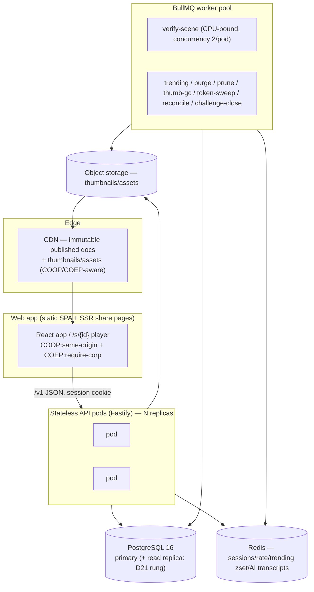

# 10 — Infrastructure & Deployment

**Status:** Accepted (Session 10, 2026-07-21) — normative for how the M0–M8 system is built, shipped, and operated
**Implements:** the brief's technical/deployment goals; ADR-0003/0004 (stacks), 01 §4 (stateless backend), R5
**Consumes:** `01-ARCHITECTURE.md` (§3 threads/transport, §4 backend, §6 versioning), `05-BACKEND.md` (§1 stateless pods, §6 auth, §9 jobs, §12 U14/U15), `08-COMMUNITY.md` (§4.2 trending, §5 verification, §5.6 divergence, §7 moderation), `09-PERFORMANCE.md` (§8 read path, §9 measurement harness), `03-SIMULATION-CORE.md` (§12 determinism suite)
**Companion file:** `types/infra.ts` (environments, isolation headers, CI matrix, secret inventory, observability budgets, migration/erasure policy — compile-tied to the constants they must not drift from)
**Consumed by:** first implementation (the actual pipelines and manifests); M10 (collaboration adds stateful services on this base)

---

## 1. Scope and principles

M9 is **operational, not architectural**: it says how the existing surface is deployed, tested, observed, and kept safe — it adds **no new API operation, DB table, error code, or engine constant** (`openapi.yaml`/`schema.sql`/`types/protocol.ts` are untouched). The only build-time additions are `types/infra.ts` and this document; the only runtime additions are HTTP response *headers*, CI pipelines, dashboards, and background policy.

1. **Stateless and 12-factor.** Every API pod is interchangeable (05 §1.5): all state lives in Postgres, Redis, and object storage, all config in the environment (§8). Horizontal scale is "run more pods."
2. **The expensive work is the user's device.** Simulation runs client-side (01 §1); the one CPU-heavy job we own is `verify-scene`, a background queue that is never in a request path (09 §8). Our server cost profile is a content/social app, and the infra reflects that.
3. **Vendor-neutral by module boundary (U14).** Object storage, CDN, and transactional email sit behind interfaces; the concrete provider is a deploy-time choice, swappable without touching call sites. This document commits to *contracts*, not brands.
4. **Determinism is an operational invariant, not just a design one.** The CI matrix (§6) and the standing divergence dashboard (§7) exist to *catch* a per-platform physics divergence in production, because a silent one would corrupt leaderboards. This is the operational half of D2/D7/D17.
5. **Safe by default per environment.** Only prod is search-indexable; secrets never enter a client bundle (§8); migrations are forward-only and dry-run on staging first (§4.2).

---

## 2. Topology



- **Web app** is static assets (SPA) plus a thin SSR layer for `/s/{id}` OG metadata (05 §4.3). It is served with the isolation headers (§3) so the simulation worker gets `SharedArrayBuffer`. It talks only to the API's `/v1` surface.
- **API pods** are stateless Fastify (`API_STATELESS`); any pod serves any request. `minApiReplicas` is 1 in dev/staging, ≥ 2 in prod (`ENVIRONMENTS`).
- **Worker pool** runs the 05 §9 BullMQ jobs. `verify-scene` is the only CPU-heavy one (`VERIFY.WORKER_CONCURRENCY = 2` per pod, 08 §5.3); it scales with publish volume, independent of read traffic (09 §8).
- **Postgres 16** primary; the D21 escalation ladder adds a read replica and then the object-storage doc hatch *only when a trigger fires* (§9). **Redis** holds nothing that is the only copy of anything (05 §9). **Object storage + CDN** carry content-addressed thumbnails/assets, cacheable forever.

`types/infra.ts` fixes the module boundary (`TOPOLOGY.VENDOR_NEUTRAL_MODULES = objectStorage · cdn · email`) and the read-scale ladder (`READ_SCALE_LADDER`), so the U14 vendor decision changes a config value, not the design.

---

## 3. Cross-origin isolation & the SAB gate (R5 / U5)

The simulation worker's primary transport is a `SharedArrayBuffer` (03 §5.4). A browser only exposes `SharedArrayBuffer` when the document is **cross-origin isolated**, which requires two response headers on the HTML document. This session validated the mechanism live (§11, spike I1) rather than trusting the spec:

| Top-level document headers | `self.crossOriginIsolated` | `SharedArrayBuffer` |
|---|---|---|
| `COOP: same-origin` **and** `COEP: require-corp` | **`true`** | available (`new SharedArrayBuffer(8)` succeeds) |
| either header missing | **`false`** | **`undefined`** — constructor throws "not defined" |

So SAB is gated *entirely* on these two headers, encoded in `CROSS_ORIGIN_ISOLATION`. Two consequences follow, and the spike settled both:

1. **The fallback is a smoothness fallback, never a correctness one.** The same shared harness produced the **byte-identical** state hash `e4dc73ff` on the isolated (SAB) and non-isolated (transferable-`ArrayBuffer` fallback, 03 §5.3) loads (spike I2b). The WASM computes the same run regardless of transport; SAB only removes per-frame allocation and decouples the renderer (09 §5.2). A page that cannot isolate still simulates correctly — it just jitters more under load.
2. **Cross-origin embeds of `/s/{id}` need a plan.** Under `require-corp`, every subresource must be same-origin or carry `Cross-Origin-Resource-Policy` (CDN assets do: `ASSET_CORP_VALUE = cross-origin`). A third party embedding the player in an `<iframe>` from *their* origin would otherwise lose isolation. The embed posture: serve the player with **`COEP: credentialless`** (`COEP_VALUE_EMBED`) — it keeps `crossOriginIsolated = true` inside the frame by loading cross-origin subresources without credentials, so SAB survives an embed without demanding CORP from every asset. If a specific embedder still can't isolate, the player degrades to the fallback transport (point 1) and runs correctly, slightly less smoothly. This closes R5 and U5: the mechanism is proven, the default and embed header sets are fixed, and the failure mode is graceful.

Isolation is required on **every** environment (`ENVIRONMENTS[*].crossOriginIsolated = true`) — determinism transport is not something a stage gets to weaken.

---

## 4. Environments & migrations

### 4.1 Three environments

`ENV_IDS = dev · staging · prod` (`ENVIRONMENTS`, exhaustive by compile proof):

| | dev | staging | prod |
|---|---|---|---|
| `robotsIndexable` | ✕ | ✕ | ✅ (only prod; others `X-Robots-Tag: noindex`) |
| `minApiReplicas` | 1 | 1 | ≥ 2 |
| `emailDeliverability` | console log | real (SPF/DKIM) | real |
| `aiProxyDefaultOn` | ✕ (paste-only, 07 §2.1) | ✕ | ✅ |
| workers / isolation | on / required | on / required | on / required |

Staging runs the full stack against a sanitized prod snapshot; it is where a migration and a determinism-baseline change are proven before prod.

### 4.2 Migrations — forward-only, and the three-version rule

Two migration systems, deliberately separate (`MIGRATIONS`):

- **Database:** a monotonically increasing integer sequence, each migration in one transaction, **never edited after landing** (`DB_FORWARD_ONLY`) — a fix is a new migration. `STAGING_DRY_RUN_REQUIRED` gates prod. The `schema.sql` in this repo is the *target* DDL and the verify-suite's oracle; the runner's job is to move any live database to it.
- **Scene format:** `schemaVersion` migrations (02 §9) run **in the app/gate at read time** (05 §5.3 step 4), not in the database — a stored document is migrated forward when someone opens it, never in a batch. A document newer than the server's `scene-format` is deploy lag, surfaced as `E_SCHEMA_NEWER`, and is **never** migrated backward (`NO_BACKWARD_MIGRATION`).

`VERSIONS` operationalizes 01 §6's *three independent version numbers* by anchoring each to its single source: `api` = `API_VERSION` (URL `/v1`), `sceneSchema` = `SCHEMA_VERSION`, `protocol`/engine identity from `PROTOCOL_VERSION` + `SIM`, plus `perfBaseline`/`verifier`/`ranking`. A deploy validates that a rolling API fleet spanning two `/v1`-compatible builds still agrees on all three — the golden-hash suite (§6) is exactly that agreement for the engine version.

---

## 5. CI/CD

### 5.1 The determinism matrix — U9 resolved (design) and made a standing signal

U9 has been the open cross-platform-determinism risk since M2. M9 closes it in two moves — a CI gate for our own builds, and a production dashboard for machines we don't own:

**CI gate (`CI`).** On every commit:
- **Golden-hash equality within an `engineVersion`** across `NODE_PLATFORMS = linux-x64 · macos-arm64` (× `NODE_MAJORS = 22 · 24`), running the headless Node SimCore `DETERMINISM_SUITE` (03 §12: `double-run`, `snapshot-restore`, `command-boundary`, `cross-platform-golden`). A hash that differs across platforms fails the build.
- **The browser triple** `BROWSERS = chromium · firefox · webkit` via Playwright — the same golden scenes run in-browser and must match the Node goldens. This matrix also carries the 09 §9 render/perf harness (draw calls, per-tier frame p95), so U25's "real target hardware + browser triple" baselines land here. The triple is exactly three engines (compile proof).

**Production signal.** `POST /scenes/{id}/runs` records whether a real player's `finalHash` matched our verifier's (08 §5.6); `idx_run_reports_divergence` is the dashboard. Anonymous players post too, because divergence data from hardware we can't buy is the data CI structurally cannot produce. A mismatch is an engine incident opened against us — ranking is unaffected because only our number ranks (D17).

The spike gave the first empirical data point behind this design: Node (darwin-arm64) and Chromium (darwin-arm64) produced **byte-identical** hashes on the pinned D7 build (§11, I2). One engine, one ISA — not the full matrix, which is why U9 narrows to "execute it in CI" rather than closing outright — but a positive signal that the shared-WASM-in-Node verifier (03 §1) and the browser client agree, which is the whole basis of D17.

### 5.2 Perf gates and artifact consistency

- **Perf regression** (`PERF_REGRESSION_RATIO = 1.15`, echoing 09 §9): any metric > 15 % off its committed baseline for `PERF_BASELINE_VERSION` = `PERF_VERSION` fails the build; a deliberate change updates the baseline in the same commit (the diff *is* the perf review).
- **Artifact-consistency suites** (`ARTIFACT_CONSISTENCY_SUITES`): `verify.mjs` (02 §9 schema/example corpus) and `verify-backend.mjs` (05 §10 — OpenAPI ↔ `ROUTES` ↔ error table, `schema.sql` under the real PG parser, DDL caps ↔ `LIMITS`) run on every commit, alongside `tsc --strict` over `types/*.ts`. These are the machine checks every prior milestone built; CI just makes them a merge gate.

### 5.3 Deploy pipeline

Build → the §5.1/§5.2 gates → deploy to staging → migration dry-run + smoke → promote to prod behind a rolling update (stateless pods, §2). Rollback is redeploy of the previous image; because migrations are forward-only, a rolled-back app build must still read the migrated schema — so migrations are written to be **backward-compatible for one release** (expand/contract), never a destructive rename in the same deploy that removes the old reader.

---

## 6. Observability

Alerts are **tied to the budgets they watch** (`OBSERVABILITY`), so changing a budget moves its alarm automatically rather than leaving a stale literal:

| Dashboard / alert | Threshold | Source it tracks |
|---|---|---|
| **Determinism divergence** (U9) | client≠server hash rate > `DIVERGENCE_RATE_ALERT` (0.1 %) | `idx_run_reports_divergence` (08 §5.6) |
| **Verify queue depth** | backlog > `VERIFY_QUEUE_DEPTH_ALERT` (= 200 × `VERIFY.WORKER_CONCURRENCY`) | the only CPU-heavy job (08 §5.5) |
| **Verify wall p99** | approaching `VERIFY_WALL_BUDGET_MS` (20 s kill switch) | 08 §5.5 budget |
| **Trending job health** | last success older than `TRENDING_MAX_LAG_S` (= 3 × `TRENDING.RECOMPUTE_S`) | 08 §4.2 cadence |
| **Perf regression** (per tier, browser triple) | > baseline × 1.15 | 09 §9 harness |
| **RUM frame telemetry** (U24) | per-tier p95 frame time, sampled `RUM_FRAME_SAMPLE_RATE` | feeds the adaptive-quality thresholds |

Standard golden signals (latency/error-rate/saturation per pod, DB/Redis health, job success rates) sit under these. The two project-specific ones are the divergence dashboard (the U9 production channel) and the verify-queue depth (the one place our CPU cost lives).

**Ranking shadow-tuning (U19/U21).** Trending parameters are unvalidated without real traffic. The mechanism: a candidate `RANKING_VERSION` scores the same candidate set **in parallel** with the live one; the two orderings are compared on the dashboard before any flip. `RANKING_VERSION` (08) is the safety latch — nothing changes user-visible order until a shadow run justifies it. Same pattern gates a `VERIFIER_VERSION` bump (re-verify lazily, 08 §5.4) and a `PERF_VERSION` baseline change.

---

## 7. Secrets & configuration

Config is environment (12-factor); secrets live in a secret manager, are **never logged, and never enter a client bundle**. `CONFIG_KEYS` is the full inventory, each tagged `secret`|`config` and `serverOnly`:

- **Auth (D12):** `SESSION_SECRET`; per OAuth provider a `{PROVIDER}_OAUTH_CLIENT_ID` + `_CLIENT_SECRET`. This is the load-bearing compile proof — the provider set is derived from `AUTH.OAUTH_PROVIDERS`, so adding a provider without its two keys fails compilation naming the missing key (`OAUTH_SECRETS` / `CONFIG_KEYS` coverage, §11 negative test N2).
- **AI (D15):** `AI_PROVIDER_API_KEY` is `secret` + `serverOnly` — the proxy holds provider keys server-side and BYO-key is rejected (07 §2.1), so this key reaching a client build is a bug by definition.
- **Data stores:** `DATABASE_URL`, `DATABASE_REPLICA_URL` (the D21 rung), `REDIS_URL`.
- **Vendor modules (U14):** `OBJECT_STORAGE_*`, `EMAIL_API_KEY`; the two public, bundle-safe values `CDN_BASE_URL` and `APP_ORIGIN` (the CORS/`__Host-`-cookie origin pin, 05 §6.6) are the only `serverOnly: false` entries.

A deploy validates that every required key is present *before* a pod serves traffic (fail fast, not at first request).

---

## 8. Data lifecycle: deletion, export, erasure (U15)

`DATA_LIFECYCLE` decides the GDPR-shaped policy 05 §12 left open. Account erasure is not a cascade — it respects that a *remix is an independent work by another author*:

| On account erasure | Action | Why |
|---|---|---|
| the user's own scenes | `purge` (hard delete rows + thumbnail objects) | their content, their right |
| lineage pointer from others' remixes | `null-pointer` | mirrors `schema.sql` `remixed_from ON DELETE SET NULL` |
| downstream remixes themselves | `survive` | someone else's work; nulling the pointer is enough |
| the user's comments | `anonymize` to a tombstone | preserves thread structure (08 §2.3) without their identity |

- **Self-serve export** (`EXPORT_FORMAT = application/json`): the current head document of every owned scene plus the profile, as one JSON bundle. Documents are already the portable unit (ADR-0005).
- **SLA:** erasure completes (all purge/GC jobs run) within `ERASURE_SLA_DAYS` (30) of a confirmed request. Retention windows are anchored to their sources: `TRASH_TTL_DAYS` = `API.TRASH_TTL_DAYS`, `APPEAL_RETENTION_DAYS` = `MODERATION.APPEAL_WINDOW_DAYS`.

The jobs to execute this already exist (`purge-trash`, `thumb-gc`, `token-sweep`, 05 §9); M9 supplies the *policy* those jobs enforce. **U15 resolved.**

---

## 9. Operations: read-path scaling & moderation

### 9.1 Read-path escalation (D21, operational view)

The read path is a plain content/social app today (09 §8). The escalation ladder (`TOPOLOGY.READ_SCALE_LADDER`) is **staged and trigger-gated**, so scale-out is planned, not reactive:

1. **`materialized-feed`** — materialize heavy-follower timelines when p95 > `FEED_P95_REVISIT_MS` (150 ms) or median followee set > `FEED_FOLLOWEE_REVISIT` (2 000) (09 §8, 08 §2.5). Endpoint shape unchanged.
2. **`read-replicas`** — add `DATABASE_REPLICA_URL` for listings when the primary's read CPU is the bottleneck; longer edge TTLs.
3. **`object-storage-docs`** — the 05 §2 escape hatch (p95 doc > 256 KB), contained to `scene_revisions`.

Each rung is a config/infra change with a named trigger, never an API redesign.

### 9.2 Moderation operations (U22)

M7 fixed the moderation *data model and effects* (D19: `visible`/`limited`/`removed`, 404-not-403, appeals); M9 fixes the *operations*:

- **Queue tooling:** a staff-only view over `content_reports`, ordered by the `AUTO_LIMIT_REPORTS` (5 distinct reporters ⇒ auto-`limited` pending review, 08 §7.2) signal; actions map to the D19 state transitions and write an **append-only audit log** (who, when, from→to state, reason).
- **Human policy:** v1 moderation is staff-decided (user-authored challenges deferred, U23; AI/hand-typed text share this queue, 07 §7.1). The org owns the roster and an SLA target; the automated path can only ever *limit* reach, never amplify (D19).
- **Retention:** a `removed` item is kept `APPEAL_RETENTION_DAYS` (30) for appeal, then purged. **U22 narrowed** — tooling, audit, and policy shape are fixed; staffing and SLA numbers are an org decision at launch.

---

## 10. Disaster recovery & backups

Posture (concrete numbers pending the vendor, U26): Postgres is the only durable system of record that isn't reconstructible — **daily base backups + WAL/PITR**; Redis is a cache and reconstructible (05 §9), so it needs no backup, only warm-restart tolerance; object storage relies on the provider's durability + versioning. The verification cache (`scene_verifications`) is rebuildable by re-running the deterministic verifier, so it is not on the critical restore path. Restores are rehearsed on staging (§4.1).

---

## 11. Spike record (2026-07-21, Session 10)

Environment: darwin-arm64, Node 24, in-app Chromium (Electron 42 / Chrome 148), `@dimforge/rapier2d-deterministic-compat@0.19.3` (D7 build), scratchpad only (not committed — S3 precedent). A tiny Node static server served a shared determinism harness (600 steps, 9 dynamic bodies: floor + 25° ramp + CCD marble + 8-domino run) with COOP/COEP toggled by query flag; the same harness ran in Node and in the browser.

| Experiment | Result |
|---|---|
| **I1 cross-origin isolation** | `COOP: same-origin` + `COEP: require-corp` ⇒ `crossOriginIsolated === true`, `new SharedArrayBuffer(8)` succeeds. Drop the headers (`?iso=0`) ⇒ `crossOriginIsolated === false`, `SharedArrayBuffer` is `undefined` (constructor throws "not defined"). The SAB transport is gated *entirely* on the two document headers — R5/U5 mechanism validated live |
| **I2 determinism, browser vs Node** | same harness, same pinned wasm: **Node = Chromium = `e4dc73ff`, byte-identical**. First cross-runtime determinism data point in the project (all prior spikes were Node-only, even S8's cross-*process*). One engine + one ISA — a positive signal for the §5 matrix and D17, not the full triple/cross-ISA confirmation (that is CI-time, U9) |
| **I2b determinism vs isolation** | isolated (SAB) and non-isolated (fallback-transport) browser loads produced the **same** hash `e4dc73ff` ⇒ SAB is a transport smoothness optimization, never a correctness input; a cross-origin embed that loses SAB still simulates bit-identically (confirms 09 §5.2 and the §3 embed posture) |

`types/infra.ts`: strict `tsc --exactOptionalPropertyTypes --noUncheckedIndexedAccess` green on all **ten** type files. **3/3 negative compile tests bite** — renaming `ENVIRONMENTS.prod` (names both `prod` missing and the extra key), dropping `GITHUB_OAUTH_CLIENT_SECRET` from `CONFIG_KEYS` (`CONFIG_KEYS misses OAuth env key: "GITHUB_OAUTH_CLIENT_SECRET"`), and dropping `webkit` from `CI.BROWSERS` (browser-triple cardinality ≠ 3).

---

## 12. Decisions & open issues

**Decided here:**
- **D22 — Deployment topology & the cross-origin isolation posture (U5).** Stateless 12-factor pods over Postgres/Redis/object-storage+CDN with a vendor-neutral module boundary (U14) and a trigger-gated read-scale ladder (D21); `COOP: same-origin` + `COEP: require-corp` on every isolated document, `credentialless` for embedded players, `CORP: cross-origin` on CDN assets — the SAB gate validated live (spike I1), the fallback proven sim-identical (I2b); three environments with forward-only, staging-dry-run migrations and the 01 §6 three-version rule anchored to its sources. Encoded in `types/infra.ts` (`ENVIRONMENTS`, `CROSS_ORIGIN_ISOLATION`, `MIGRATIONS`, `VERSIONS`, `TOPOLOGY`).
- **D23 — CI/CD determinism+perf matrix (U9) & operational posture.** A cross-platform golden-hash gate (linux-x64 + macos-arm64 × Node LTS) plus the Chromium/Firefox/WebKit Playwright triple carrying the 09 §9 perf/render harness, wired to the existing `verify.mjs`/`verify-backend.mjs`/`tsc` suites; observability alerts tied by construction to the budgets they watch (divergence, verify-queue, trending lag, per-tier perf); ranking/verifier/perf changes gated by shadow-tuning behind their version latches (U19/U21/U24); the account-erasure/export policy (U15) and moderation operations (U22). Encoded in `CI`, `OBSERVABILITY`, `CONFIG_KEYS`, `DATA_LIFECYCLE`.

**Resolved / narrowed:**
- **U5 ✅ resolved** — isolation headers proven to gate SAB (I1), embed posture (`credentialless`) fixed, fallback proven correct (I2b).
- **U15 ✅ resolved** — erasure policy (own scenes purge, lineage null, remixes survive, comments anonymize), JSON export, 30-day SLA (§8).
- **U9 → resolved (design), narrowed to execution** — the CI matrix and the standing divergence dashboard are specified; the spike gives a first byte-identical Node≡Chromium data point; the full triple/cross-ISA confirmation is the CI run at first implementation.
- **U14 → narrowed** — vendor picks stay deferred but now sit behind fixed module interfaces + the `CONFIG_KEYS` inventory; concrete selection is a deploy-time value, not a design gap.
- **U22 → narrowed** — moderation tooling, audit log, and policy shape fixed (§9.2); staffing and SLA are an org decision at launch.
- **U19/U21/U24/U25** → mechanisms in place (shadow-tuning latches §6, RUM telemetry, the browser-triple perf harness §5); each still needs real traffic/devices at/after launch.

**Opened:**
- **U26 (new):** concrete DR/backup targets (RPO/RTO, PITR retention window) and secret-rotation cadence are posture-only here (§7, §10) — commit numbers against the chosen vendor (U14) at first deploy.
- Carried: U7/U10/U12/U16/U17/U18/U20 (first implementation / re-measure), U11 (art pass), U13/U23 (M10).

---

## 13. Changelog

- **2026-07-21 (Session 10, M9):** initial acceptance. D22 (topology + cross-origin isolation + environments/migrations), D23 (CI/CD determinism+perf matrix + observability + data-lifecycle/moderation ops). `types/infra.ts` added. No changes to the scene format, engine constants, API (`openapi.yaml`), or DB schema (`schema.sql`) — M9 deploys the existing surface; the only runtime additions are HTTP headers, CI pipelines, dashboards, and policy. U5/U15 resolved; U9 resolved-by-design (execution is CI-time); U14/U22/U19/U21/U24/U25 narrowed; U26 opened.
```
