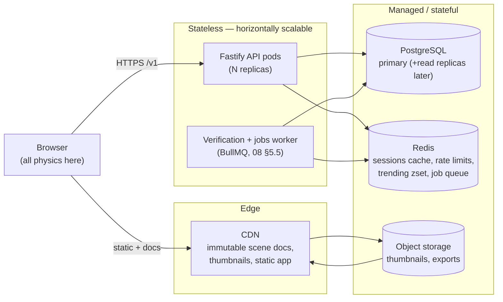

# 10 — Infrastructure & Deployment

**Status:** Accepted (Session 10, 2026-07-21) — normative for CI/CD, hosting, environments, and operations
**Implements:** the brief's technical/deployment goals; 01 §4 (thin stateless backend), R5 (SAB isolation/embeds)
**Consumes:** `05-BACKEND.md` (topology, secrets, jobs), `08-COMMUNITY.md` (§5 verification, §5.6 divergence signal), `09-PERFORMANCE.md` (§8 read-path, §9 perf harness), `03-SIMULATION-CORE.md` (§12 determinism suite)
**Companion files:** `types/infra.ts` (environments, CI matrix, migration/isolation/observability constants — compile-tied); `.github/workflows/{ci,determinism-matrix,deploy}.yml`; `verify-infra.mjs`
**Consumed by:** first implementation (this is the last design milestone before code); M10 (collaboration/monetization ride this topology); M11 (roadmap)

---

## 1. The one shape everything rests on

Every prior milestone earned the same property, and this document only has to *operate* it:

> The expensive work — simulation — runs on the **user's device**. The backend is a plain content/social app with exactly **one** CPU-heavy job we own: the leaderboard verification queue (08 §5), and even that is a background worker, never in a request path (01 §1).

So the infrastructure is deliberately unremarkable: stateless API pods behind a load balancer, managed Postgres + Redis, object storage + CDN, and a queue worker. There is no GPU fleet, no physics tier, no fan-out write path (D21). The three things that are *not* unremarkable — and are therefore what this document spends its words on — are:

1. **Determinism is a cross-platform promise, and CI is the only place it is proven** (U9). A leaderboard is only meaningful if a run computes the same hash on every machine that plays it. §6.
2. **The client needs `SharedArrayBuffer`, which needs COOP/COEP, which breaks naïve embeds** (U5/R5). §3.
3. **Two independent version axes migrate forward** — the SQL schema and the scene `schemaVersion` — and a bad migration is the one irreversible mistake this otherwise-stateless system can make. §5.

Everything else (hosting, secrets, observability, account lifecycle) is standard practice, specified here so implementation has no open questions.

---

## 2. Topology (D22)



- **API pods are stateless** (sessions live in Postgres + a Redis read-through cache, D12) → scale horizontally, roll freely, no sticky routing. Readiness (`HEALTH.path` = `/healthz`, taken verbatim from `api.ts ROUTES.healthCheck`) additionally probes Postgres + Redis reachability; the load balancer drains a pod after `HEALTH.unhealthyThreshold` failed probes.
- **One worker deployment** runs the BullMQ jobs already inventoried in 05 §9 (purge, prune, thumb-GC, token sweep, counter reconcile, trending recompute) plus the M7 verification queue. `WORKER_CONCURRENCY` (2, pinned to cores, from `VERIFY`) is the only knob; capacity is ~17 CPU-min/day at 10 k publishes (09 §8).
- **CDN fronts immutable content.** A published revision is content-addressed (05 §3), so its document is cache-forever at the edge (`READPATH.SCENE_DOC_CDN_S` = 1 y); thumbnails and the static app bundle likewise. This is what keeps the origin's read load flat under virality (D21).

**Vendor posture (U14):** the design is cloud-agnostic 12-factor. Each stateful dependency sits behind a driver interface (`OBJECT_STORAGE_KEY`, `EMAIL_API_KEY`, `DATABASE_URL`, `REDIS_URL` in `SECRETS`), so the concrete vendor is a deployment choice, not an architectural one. The recommended default for MVP is a single-provider managed stack (managed Postgres + managed Redis + S3-compatible storage + a CDN in front), chosen at implementation; nothing above depends on which. Object storage / CDN and transactional email (SPF/DKIM deliverability) are the only two picks with real lock-in, and both are isolated to their driver.

---

## 3. Cross-origin isolation & embeds (U5 / R5)

The simulation worker's primary transport is a `SharedArrayBuffer` (01 §3.1, `SAB`). Browsers only expose SAB when the document is `crossOriginIsolated`, which requires two response headers on the app's own pages:

| Header | Value (`ISOLATION`) | Why |
|---|---|---|
| `Cross-Origin-Opener-Policy` | `same-origin` | Severs the window from cross-origin openers |
| `Cross-Origin-Embedder-Policy` | `credentialless` | Grants isolation **without** requiring a CORP header on every cross-origin subresource — so CDN assets, thumbnails, and OAuth redirects load normally. (`require-corp` also grants isolation but would force CORP on every asset; `credentialless` is the pragmatic choice.) |

The predicate is exact and testable (`grantsIsolation`, proven in `verify-infra.mjs` §F): isolation is granted **iff** COOP is `same-origin` and COEP is `credentialless` or `require-corp`.

**The embed problem and its resolution.** A third-party page that embeds our player in an `<iframe>` cannot make *our* document isolated unless it also sets these headers on *itself* — most won't. R5 flagged this as an open sharing-reach question. The resolution is that **SAB is an optimization, not a requirement**:

- The player probes `self.crossOriginIsolated` at boot. Isolated → SAB triple-buffer. Not isolated → the transferable-`ArrayBuffer` fallback (double-buffered `postMessage`), which 09 §5 (spike P2) measured at ~16 µs/frame copy versus ~2 µs SAB write — both < 0.1 % of the frame budget. **The run is byte-identical either way; only the transport differs.** Determinism does not depend on isolation.
- First-party pages (`app.example`, the `/s/{id}` share page) always send the headers and get SAB.
- Embeddable contexts advertise `?embed` (`ISOLATION.EMBED_QUERY_FLAG`) so the client skips the SAB probe and goes straight to the fallback, avoiding a console warning and a wasted feature-detect.

So embeds work everywhere, at a transport cost that the M8 spike proved is negligible. Isolation is required in `dev`/`staging`/`prod` for first-party pages (`ENVIRONMENTS[*].crossOriginIsolated = true`) and simply absent for third-party embeds.

---

## 4. Environments, configuration & secrets

Three environments (`ENV_IDS`): `dev` (local, seed data, AI off), `staging` (real infra shape, seed/anonymized data, AI live against a low quota), `prod` (real data, erasure jobs enabled). The web origin and the four booleans that differ are in `ENVIRONMENTS`.

**Configuration** is environment variables only (12-factor); no config is baked into an image, so the *same* image promotes dev→staging→prod. The scene format's `schemaVersion`, the `engineVersion` pin (`ENGINE_BUILD`), and all budget constants live in the typed source (`types/*.ts`), not in env — they are code, versioned and CI-checked, never per-environment toggles.

**Secrets** (`SECRETS`, names only — no value is ever committed): all are `server-only`, grouped by the decision that makes them so.

| Secret | Rotation | Server-only because |
|---|---|---|
| `AI_PROVIDER_KEY` | 90 d | **D15** — the AI proxy holds provider keys; BYO-key was rejected. The client never sees it. |
| `SESSION_SECRET`, `OAUTH_{GOOGLE,GITHUB}_SECRET` | 30 / 180 d | **D12** — DB sessions + PKCE OAuth; secrets sign/exchange server-side only. |
| `DATABASE_URL`, `REDIS_URL`, `OBJECT_STORAGE_KEY`, `EMAIL_API_KEY` | 90 d | **D22** — datastore + vendor driver credentials. |

Secrets are injected from the platform's secret manager at deploy; rotation is a redeploy with the new value (sessions survive a `SESSION_SECRET` rotation via a two-key overlap window). The determinism supply chain is itself a secret-adjacent concern: `ENGINE_BUILD` is exact-pinned (D7) and the lockfile is committed, so a dependency swap that could change a hash cannot happen silently — it is a reviewed version bump that re-keys the goldens (§6).

---

## 5. Schema migrations — the two axes

This stateless system has exactly one irreversible operation, and it is a migration. Both axes are **forward-only** and run **before** new code takes traffic (`DEPLOY.migrateBeforeTraffic`).

### 5.1 SQL DDL (`MIGRATION.ddlRunner` = transactional-forward-only)

Ordered, numbered migration files applied by a Flyway-style runner inside a transaction, recorded in a `schema_migrations` ledger table. A rollout is gated on the migration succeeding; a failed migration aborts the deploy with the old image still serving. DDL is written **expand-then-contract** so a migration is always compatible with the *currently running* code (add column nullable → deploy code that writes it → backfill → deploy code that reads it → drop the old) — this is what lets a rolling deploy never see a schema the running pod doesn't understand.

### 5.2 Scene `schemaVersion` (`MIGRATION.currentSchemaVersion` = `SCHEMA_VERSION` = 1)

A scene document carries its own `schemaVersion`. The **migration runner** (reference implementation proven in `verify-infra.mjs` §E) chains single-step migrations from a document's version up to the app's current version, then re-validates against `scene.schema.json`:

```
runMigrations(doc, registry, target):
  cur ← doc.schemaVersion                 # numeric, or E_MIGRATION
  if cur > target: reject                  # forward-only: a v5 doc on a v1 app is refused, not guessed
  while cur < target:
    step ← registry.find(from = cur)       # or E_MIGRATION "no migration from N"
    assert step.to == step.from + 1        # gap-free: single-step only
    doc ← step.migrate(doc); doc.schemaVersion ← step.to; cur ← step.to
  validate(doc) against scene.schema.json  # fail ⇒ E_MIGRATION
```

Its guarantees, each executed as a fixture in the spike:

- **E1 — identity at current version.** At `schemaVersion` 1 the registry is empty (`SCENE_MIGRATIONS = []`); a current doc passes through untouched and re-validates. This is the live case today.
- **E2 — forward migration re-validates.** A synthetic v0→v1 migration takes a legacy doc to current and it passes the *full* strict schema — the migration's job is to produce a document indistinguishable from a natively-current one.
- **E3 — gap-free.** A registry with a `0→2` step is rejected by the single-step guard, never silently skipping v1.
- **E4 — forward-only.** A document newer than the app (v5 on a v1 client) is rejected with a clear error, never partially loaded.

The runner runs in **two places** with the same code (the `scene-format` package, per 00-PROGRESS §5): client-side at load (05 key flow "migrate old versions forward"), and as an **offline backfill job** that rewrites stored documents after a `schemaVersion` bump so the read path never migrates on the fly. Because migration output re-validates against the strict schema, a migration that produces an invalid document fails CI (a golden corpus of every historical version is migrated forward and validated) — not production.

---

## 6. CI/CD (D23) — and the U9 resolution

Two gating workflows plus a deploy pipeline. A release is blocked until both gates are green (`DEPLOY.gatedByCi`).

### 6.1 `ci.yml` — the everyday gate (fast)

Runs on every push/PR: `tsc --strict --exactOptionalPropertyTypes --noUncheckedIndexedAccess` over `types/*.ts`, plus the three verify suites these sessions built as first-class CI jobs — `verify.mjs` (ajv scene corpus), `verify-backend.mjs` (OpenAPI 3.1 + the real PG grammar via pgsql-parser + three-way error-code equality), and the new `verify-infra.mjs` — and unit tests across Node `CI_NODE_VERSIONS` (20, 22). The verify suites are the accumulated "verified, not just written" bar turned into a merge gate.

> **Implementation note (P0, Session 13 — D29).** The suites now live in `tools/` and run as one matrixed `verify` job over five of them: the three above (`verify.mjs` renamed `verify-scene.mjs`), plus `verify-roadmap.mjs` (authored in M11, never wired) and `verify-workspace.mjs` (the P0 skeleton check). Compiler options moved from bare `tsc` flags into `tsconfig.base.json`, since the flag-only form defaulted to `target: ES5` and could not have passed. The *gate* is unchanged — same merge criterion, same suites, now executable on a fresh clone via `pnpm run ci`.

### 6.2 `determinism-matrix.yml` — the U9 resolution

Determinism is a *cross-platform* promise (01 §3.4). Every session's spike proved it on **one** machine (S3/S6/S8/S9, all darwin-arm64); U9 is the standing question of whether it holds across ISAs and browsers. This workflow is the answer:

| Job | Fans out over | Proves |
|---|---|---|
| `node-golden` | `DETERMINISM_RUNNERS` = **ubuntu-latest (x86-64) × macos-14 (arm64)** × Node 20/22 | The environment-free SimCore (03 §1) produces **byte-identical state hashes** across ISAs. This is the cross-ISA property S8's E1 (cross-*process*) could not reach on one machine. |
| `browser-golden` | `BROWSER_TRIPLE` = **chromium × firefox × webkit** (Playwright) | The same golden scenes hash identically in-browser, and equal to the Node golden — the WASM build + SAB transport agree across engines. Carries the 09 §9 render/perf gate (per-tier frame p95, draw-call ceiling vs committed `PERF_VERSION` baselines). |

Both matrices are **three-way pinned**: the OS/browser/node sets in the YAML are cross-checked against `types/infra.ts` (`DETERMINISM_RUNNERS`, `BROWSER_TRIPLE`, `CI_NODE_VERSIONS`) by `verify-infra.mjs` §B, and both ISAs are additionally a *compile* proof in `infra.ts` (`_U9Linux`/`_U9MacArm`) — dropping either the linux or the arm64 runner fails the TypeScript build naming U9. So U9 cannot be silently weakened by editing a matrix.

Golden hashes are keyed by `CI.GOLDEN_KEY_VERSIONS` (engine build + verifier + ranking + prompt + perf versions). A mismatch **not** explained by one of those changing is an *engine incident* opened against us (08 §5.6) — never an accusation against a contributor. A nightly `schedule` re-runs the browser triple against driver drift even when nothing changed.

### 6.3 `deploy.yml`

Triggered by successful `ci` **and** `determinism-matrix` on `main`. Staging deploys automatically (run migrations → rolling API update → smoke test: `/healthz` readiness + one save→publish→verify round-trip); prod follows after staging is healthy, same runner, `rolling` strategy behind the load balancer, migrations first inside a transaction. The same image promotes across environments; only env vars and secrets differ.

---

## 7. Observability (D24)

Standard three pillars (structured JSON logs with a request id, RED metrics per route, distributed traces on the write path) plus **three domain signals** this platform specifically needs, wired to alerts:

| Signal | Source (`OBSERVABILITY`) | Alerts when |
|---|---|---|
| **Determinism divergence (U9 in production)** | `idx_run_reports_divergence` on `run_reports` (08 §5.6) — client-vs-server hash disagreement, keyed by `engine_version` | Divergence rate for an `engineVersion` rises above baseline → engine incident. Anonymous players feed this (IP-bucketed) because divergence from machines we don't own is exactly the data CI can't produce. This is the continuous half of the U9 answer; §6.2 is the pre-merge half. |
| **Verification queue** | depth over `scene_verifications`; capacity budgets `VERIFY_WALL_BUDGET_MS` / `WORKER_CONCURRENCY` / `BODY_BUDGET` echoed from `VERIFY` so the alarm can't drift from 08 §5.5 | Backlog freshness exceeds `SLO.VERIFY_FRESHNESS_MIN` (15 min) → scale the worker. |
| **Trending job health & shadow-tuning (U19/U21)** | the ranking job writes live scores to the Redis zset and *also* a candidate ordering to a shadow zset (`TRENDING_SHADOW_SUFFIX`) under a trial `RANKING_VERSION` | The live/shadow orderings are diffed **offline** against real traffic; a parameter change is promoted by bumping `RANKING_VERSION` only after review. Live order is never touched by an experiment. |

**SLOs** (`SLO`): read availability 99.9 %, write 99.5 % (argon2/OAuth make writes heavier), p95 scene-GET 200 ms (cache-fronted), p95 explore 300 ms. Verification is a queue, so its SLO is freshness (15 min), not latency. The 09 §9 per-tier perf regression gate is the *build-time* SLO for the client; `PERF_GATE` sets the thresholds (frame p95 ≤ tier budget × 1.1, throughput regression ≤ 1.15×) and runs on every tier (`CI_PERF_TIERS`, exhaustive over `TierId`).

---

## 8. Operational data flows

### 8.1 Account deletion, export & erasure (U15)

No schema change — the mechanism is the `deleted_at` soft-delete columns already in `schema.sql` (`users`, `scenes`, `comments`) plus the existing purge job:

- **Export** (right to portability): a job bundles the user's scenes (documents at head revision), profile, and social edges into a downloadable archive in object storage, link emailed, TTL-expired. Read-only over existing tables; no new endpoint semantics beyond a request + a signed download.
- **Erasure** (right to deletion): `users.deleted_at` is set (immediate logout, handle released after cooldown), then the purge job hard-deletes personal data. The **remix-lineage policy** (sketched in 05 §12, decided here): the user's *scenes* are purged, but a scene that others **remixed** survives as an `unavailable` lineage node (08's placeholder that never leaks what it hid) — the derivative works of other users are not destroyed by an upstream author's deletion, and `remixed_from` pointers into a purged scene are nulled, not cascaded. This is the one place "erase my data" and "don't destroy other people's work" conflict, and the tie goes to preserving the derivatives while removing the personal data and attribution.

### 8.2 Moderator operations (U22)

The **data model** is already in place (08 D19: `content_reports`, `moderation_state`, the effects matrix, 404-not-403, appeal retention). M9 adds the **operational half**: a moderator queue UI over `content_reports`, actions that only ever *limit* reach (never expand it), and an append-only audit log of every moderation action (who, what, when, prior state) for the 30-day appeal window. The human policy (who moderates, SLA, appeal handling) is an operations decision, not a code decision, and is owned by whoever runs the deployment; the system enforces only that actions are logged, reversible within the window, and reach-limiting.

### 8.3 Backup & DR

Postgres is the only source of truth that isn't reconstructible (Redis is a cache + rebuildable zsets; object storage is content-addressed + re-derivable thumbnails). Point-in-time recovery (WAL archiving) with a tested restore runbook; object storage cross-region replication; RPO ≤ 5 min, RTO ≤ 1 h as the MVP target. Because scene documents are immutable and content-addressed, a restore can never corrupt a published run's identity — the hash either resolves or it doesn't.

---

## 9. Security & compliance posture

Consolidates the choices already made, made concrete for deployment: TLS everywhere; HSTS; the `__Host-` session cookie (D12) pinned to the API origin; Origin-check CSRF (D12); argon2id login cost sized against its rate buckets (05 §8); the COOP/COEP pair (§3); a strict CSP on the app (scenes are data, never code — 01 §6, no user scripts in MVP); dependency lockfile committed with the `ENGINE_BUILD` exact-pin so the determinism supply chain can't shift silently; secrets server-only with rotation windows (§4). The AI proxy's injection blast radius stays bounded per 07 §7 (no tools, findings-only client input, full gate on output) — nothing in M9 widens it.

---

## 10. Decisions & open issues

**Decisions recorded this session:**

- **D22 — Topology & vendor posture.** Cloud-agnostic 12-factor: stateless Fastify pods + one jobs/verification worker + managed Postgres/Redis + object storage/CDN; the same image promotes across `dev`/`staging`/`prod`; every stateful dependency behind a driver so the vendor pick (U14) is a deploy choice, not architecture. CDN edge-caches immutable content-addressed docs forever (D21 read-path). §2, §4.
- **D23 — CI/CD & the U9 determinism gate.** Two gating workflows (`ci` fast; `determinism-matrix` cross-ISA + browser-triple golden hashes) plus a gated `deploy`; goldens keyed by the engine/verifier/ranking/prompt/perf versions; the U9 matrix is three-way-pinned (YAML ↔ `infra.ts` ↔ a compile proof). Migrations run before traffic, expand-then-contract. §5, §6.
- **D24 — Observability & shadow-tuning.** Three domain signals (determinism divergence = production U9, verification-queue freshness, trending live/shadow diffing = U19/U21) on top of the standard three pillars; SLOs + the 09 §9 per-tier build-time perf gate. §7.
- **D25 — Account lifecycle & moderator ops.** Export + erasure over existing soft-delete columns (no DDL); the remix-lineage tie resolved (purge the author's scenes, preserve others' derivatives as `unavailable` nodes, null the pointers) — closes U15; moderator queue + append-only audit log over the M7 data model, reach-limiting only — closes U22 (data), leaves human policy to operations. §8.

**Unresolved issues (status after S10):**

- **U9 → resolved by construction, monitored continuously.** `determinism-matrix.yml` proves cross-ISA + cross-browser hash identity pre-merge (§6.2) and `idx_run_reports_divergence` monitors it in production (§7). The first real cross-platform golden run happens when the `engine` package lands (the workflow steps are stubbed to that package today); until then the *gate shape* is proven (matrix wiring, three-way pin, key versions) but not the hashes themselves — tracked as the one remaining first-implementation confirmation.
- **U5 → resolved.** COOP/COEP `credentialless` for first-party isolation; embeds use the identical-result µs-scale fallback; the predicate + fallback selection are executable-proven (§3). Embed *reach* is now a non-issue, not a compromise.
- **U14 → narrowed to a deploy-time pick.** The architecture is vendor-neutral behind drivers; object storage/CDN and transactional-email deliverability remain the two picks with lock-in, isolated to their driver → chosen at first implementation.
- **U15 → resolved (policy + mechanism);** operational runbook (support flow, verification of requester identity) → operations.
- **U19/U21 → mechanism resolved (shadow zset + `RANKING_VERSION` promotion);** the actual parameter values still need real traffic → post-launch tuning.
- **U22 → data model + enforcement invariants resolved;** human moderation policy → operations.
- **U25 (M8) → partly addressed:** the 09 §9 harness now has a home (`determinism-matrix.yml` browser triple + per-tier perf gate); real per-tier hardware baselines still land at first implementation.
- **U26 (new):** the CI golden hashes are proven *in shape* only — the SimCore/render/perf steps are stubbed to packages that don't exist yet (00-PROGRESS §5). First implementation must wire them and commit the first real cross-platform baseline; only then is U9 empirically (not just structurally) closed.
- U7/U10/U12/U16/U17/U18/U20 (first implementation / re-measure), U11 (first-implementation art), U13/U23 (M10) unchanged.

**This is the final design milestone.** M10 (multiplayer roadmap & monetization) and M11 (consolidated MVP→production roadmap) are planning documents; implementation begins after M11 against the layout in 00-PROGRESS §5, and every artifact these ten sessions produced — the schema, the OpenAPI surface, the typed constants, and the four verify suites now wired as CI gates — is the executable contract it starts from.

---

## 11. Spike record (2026-07-21)

Verified, not just written — `verify-infra.mjs` run in the scratchpad (`npm i ajv yaml`), all checks green, every check confirmed to bite:

- **A** — all three workflow YAMLs parse and are structurally valid (name + `on` + jobs, each job with `runs-on` + steps).
- **B** — the U9 matrix is consistent three ways: `infra.ts` `DETERMINISM_RUNNERS`/`BROWSER_TRIPLE`/`CI_NODE_VERSIONS` == the `determinism-matrix.yml` job matrices, with both ISAs present.
- **C/D** — every workflow path named in `infra.ts` exists; every `OBSERVABILITY` name (`idx_run_reports_divergence`, `run_reports`, `scene_verifications`) resolves to a real object in `schema.sql`.
- **E** — the migration runner executes its four contract fixtures (identity-at-current, forward-migrate-and-revalidate, gap rejection, future-version rejection) against the real `scene.schema.json`.
- **F** — the cross-origin-isolation predicate returns the correct grant/deny for the credentialless pair, the require-corp pair, a missing-COEP embed, and an unsafe-none COOP.
- **Negative tests (5 runtime + 2 compile) all bit naming the offender:** dropping `macos-14` from `infra.ts` (compile: `U9: macos-arm64 determinism runner missing`) and from the YAML matrix (`node-golden.matrix.os ≠ DETERMINISM_RUNNERS`); dropping `webkit` (compile: `BROWSER_TRIPLE misses: "webkit"`; runtime: matrix ≠ triple); renaming the divergence index out of `schema.sql`; and emptying a job's steps.
- `tsc --strict --exactOptionalPropertyTypes --noUncheckedIndexedAccess` passes on all **ten** type files including `types/infra.ts`. No change to `openapi.yaml`, `schema.sql`, or `scene.schema.json`, so `verify-backend.mjs` is untouched (nothing new to check on that surface).
