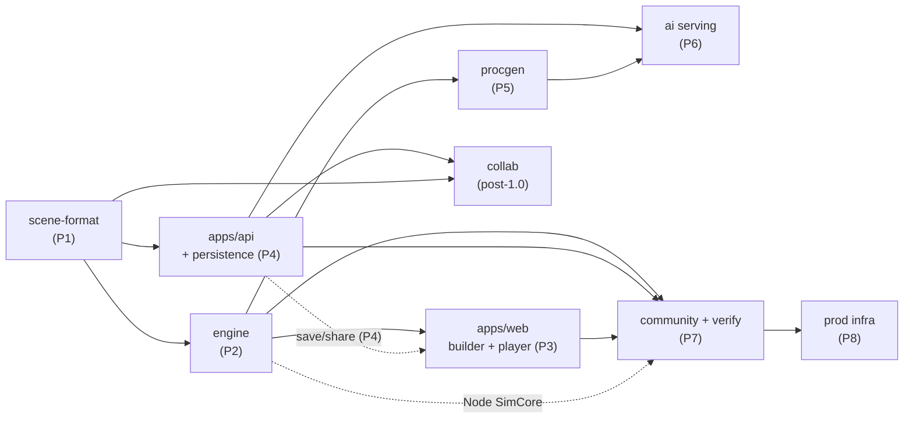
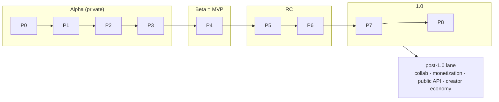

# 12 — Development Roadmap: MVP → Production

**Status:** Accepted (Session 12, 2026-07-22)
**Deliverable:** brief item 13 (*Development roadmap from MVP to production*).
**Depends on:** every prior doc — `01-ARCHITECTURE.md`, `02`…`11`, `ADR-0001`…`0005`, `types/*`, `schema.sql`, `openapi.yaml`, the three `verify*.mjs` suites, `.github/workflows/*`.
**Kind:** a *plan over the existing artifacts*, not new design. This document closes the project's **design phase**: it turns the eleven specs (M0–M10) into an ordered build with an already-written definition-of-done, and it is the last milestone.

---

## 1. How to read this

The design phase produced **contracts**: a scene format (02), a determinism spec (03), a builder UX (04), a backend surface (05), procgen (06), an AI pipeline (07), community (08), a perf budget (09), infrastructure (10), and a multiplayer/monetization roadmap (11) — each with machine-checked companions in `types/`, `schema.sql`, `openapi.yaml`, and three `verify*.mjs` suites. **This document does not re-open any of them.** It answers three questions the specs deliberately left to implementation:

1. **In what order** do the `packages/*` and `apps/*` of the 01 §5 layout get built, and *why that order*? (§2–§4)
2. **When is a phase done?** — the definition-of-done is not new here; it is the CI/verify gates that already exist in shape (10 §6). Implementation *wires* them; it does not invent them. (§5)
3. **Where does every open question go?** — every carried `U`-issue (U1…U29) lands in exactly one phase, bucketed as *resolved-in-design*, *first-implementation*, or *post-launch/business*. (§6)

The post-MVP surfaces (collaboration, monetization, public API) are placed on the timeline in §7; the brief's 13 deliverables are traced to their satisfying docs in §8; carried implementation risk is inventoried in §9; and §10 defines what "production" means — the exit of the whole project. The sequencing itself is the milestone's decision, **D28** (§11).

> **Traceability is the bar.** M8–M10 established that roadmap-grade milestones are held to *traceability*, not new normative contract. Accordingly this doc ships one machine check — `verify-roadmap.mjs` — which parses the tables below and asserts that the coverage is total: all 29 U-issues placed exactly once, all 13 brief deliverables traced, every package/app sited, and the phase order a valid topological sort of the dependency DAG. A roadmap that silently drops a U-issue or a package fails the build.

---

## 2. The dependency spine — why this order

The build order is forced, not chosen, by the package DAG of the 01 §5 layout. `scene-format` is the format every other package reads or writes; `engine` reads it; `procgen` and `web` need a working `engine`; `api` needs `scene-format`'s validator; `community`, `ai`-serving, and `collab` sit on `api`.

There is deliberately **no build edge from `api` to `web`**: the builder/player ships as a purely local sandbox at P3 (drafts in IndexedDB), *before* the backend exists. Save/share is a P4 capability *added to* the already-built web app (the dotted edge), not a prerequisite that would force web after api. That is what lets the highest-risk work (P1–P3, all client-side) proceed without waiting on any backend.

**The one load-bearing sequencing decision (D28): derisk determinism before breadth.** The project's central technical bet is that a run is a *pure function of `(document, engineVersion)`* that replays **byte-identically on every machine** (01 §3.4, DET-1…DET-11). Four otherwise-independent features are built on that single assumption:

- leaderboards recompute metrics server-side and trust no client number (D17, 08 §5);
- procgen self-checks generated scenes in a headless SimCore (D13, 06 §8);
- AI generation validates candidates through the same sim gates (D16, 07 §5);
- production monitors live divergence as the health of the whole promise (D24, 10 §7).

If cross-platform determinism does not hold, all four change shape at once. U1 (the Rapier build) is *resolved-in-design* (D7 — official deterministic package, spike hash `91a2b287`), and U9 (cross-ISA + cross-browser identity) is *resolved-by-construction* (the `determinism-matrix.yml` gate, three-way-pinned) — but both are proven **in shape only**: U26 records that the matrix's golden hashes are stubbed to packages that do not exist yet. Therefore the earliest hard gate in the plan is **P2's determinism-matrix going green with real hashes and the first committed cross-platform baseline.** Nothing broad is built until that bet is empirically closed. This is why `engine` (P2) precedes everything except the format it consumes.

The corollary: the lowest-risk, fully-specified, already-verified package — `scene-format` — goes first (P1) as the stable substrate, so the risky engine is built against a frozen contract.

---

## 3. Build phases (P0–P8)

Each phase names the package/app it delivers, the spec that is its contract, the U-issues it closes, and its **definition-of-done** — an existing CI/verify gate (§5), not a new artifact. A phase is *shippable* on its own (the release cuts in §4 bundle phases into user-facing versions).

| Phase | Package / app | Contract (spec) | Closes U-issues | Definition of done (the gate) |
|---|---|---|---|---|
| **P0** | Repo bring-up: `pnpm` workspaces + Turborepo, the `packages/*`/`apps/*` skeleton, `docs/`, the three `verify*.mjs` wired into `ci.yml`, secrets/env plumbing | 01 §5 layout; 10 §5–6 | — | `ci.yml` green on an empty monorepo: `tsc` + all three verify suites run as merge gates (10 §6.1). The stubs the M9 workflows already reference (`packages/*`) now exist. |
| **P1** | `packages/scene-format` — `scene.schema.json`, `src/scene.ts`, type guards, defaults, the `schemaVersion` migration runner | 02 (`D5/D6/D8`), ADR-0005 | (substrate for all) | `verify-scene.mjs` green in CI (schema compiles ajv-strict; examples validate; the 15 negatives reject); `tsc --strict`. This package is already fully authored and verified in design — P1 is packaging, not design. |
| **P2** | `packages/engine` — Rapier2D-deterministic wrapper, the Web-Worker host + SAB triple-buffer transport, `dmath.ts`, custom force layer, Gauss-Seidel constraint layer, analytics accumulator, snapshot/reset; the **same core runnable in Node** for CI/replay | 03 (`D7/D8`, DET-1…DET-11), ADR-0002 | **U9** (empirical), **U26** (real hashes), **U7** (defaults confirmed under real sim), **U20** (verify cost constants re-measured) | **`determinism-matrix.yml` green with real golden hashes** across linux-x64 × macos-arm64 (Node LTS) and the chromium/firefox/webkit triple, first cross-platform baseline committed; force-layer unit checks; command-boundary + round-trip suites. This is the project's keystone gate. |
| **P3** | `apps/web` — React builder (place/move/rotate/link, snap, anchors), Three.js `InstancedMesh` renderer, play-mode UI over the 03 §5 protocol, analytics panel, IndexedDB local drafts. **Ships as a purely local sandbox** (no backend yet). | 04 (`D9`), 09 (`D20`), 01 §3 | **U11** (art/asset pass), **U12** (touch, real devices), **U24** (adaptive-quality thresholds), **U25** (per-tier hardware baselines) | Per-tier **perf gate** green (09 §9, exhaustive over `TierId`, wired in `determinism-matrix.yml`); the 88-group draw ceiling and awake-set frame budget met on the `low`-tier reference device. Real-device telemetry validates U12/U24/U25. |
| **P4** | `apps/api` — Fastify over PostgreSQL: `scenes` CRUD + revisions/publish FSM, auth (DB sessions, argon2id, PKCE OAuth), remix lineage, thumbnails to object storage/CDN. `apps/web` gains save/load/share/remix. | 05 (`D10/D11/D12`), ADR-0004 | **U3** (confirmed under load), **U14** (vendor picks made: object storage/CDN, transactional email) | `verify-backend.mjs` green (OpenAPI ↔ `types/api.ts` ↔ `schema.sql` ↔ the format schema, DDL parses under the real PG grammar); auth + Origin-CSRF integration tests; migration runner exercised (10 §5.1). |
| **P5** | `packages/procgen` — stage-grammar generator, serpentine layout CSP, the **verify-by-simulation** self-check reusing P2's headless SimCore, Generate dialog (04 §3.1). Fully client-side, seeded. | 06 (`D13/D14`) | **U10** (gear stage), **U16** (estimate-model recalibration), **U17** (weak-hardware wall-time / fast-preview) | The G1–G6 gates run against the real SimCore; procgenVersion byte-reproducibility (PG-1…PG-6); fast-preview preset meets the U17 wall-time budget on the `low` tier. |
| **P6** | `packages/ai` + `apps/api` `/ai/*` routes — server-side proxy (SSE), prompt compiler from the 02 tables, structured-outputs shape rail, validation/repair loop reusing procgen's `check.ts` **verbatim**, quota buckets + circuit breaker. | 07 (`D15/D16`) | **U18** (structured-outputs transform on the real schema) | The eval corpus meets target gate-pass rates per model; every few-shot exemplar passes the full gate in CI (a broken exemplar *teaches* mistakes); quota/budget error codes (`E_AI_BUDGET`/`E_AI_UNAVAILABLE`) integration-tested. |
| **P7** | Community over `apps/api` + `apps/web` — gallery/trending/feed, likes/comments/follows, challenges, and the **verification queue** (Node SimCore recomputes every rankable metric — U2 by construction). Moderation reach-limiting + audit. | 08 (`D17/D18/D19`), 09 §8 (`D21`) | **U2** (empirical), **U19/U21** (trending shadow-tuning begins on real traffic), **U22** (data model live; staffing → ops) | `verify-backend.mjs` green over the +5 community tables; the `verify-scene` job reproduces leaderboard numbers deterministically; trending live/shadow zset diffing observable (10 §7, D24). |
| **P8** | Production infra — the gated `deploy.yml`, expand-then-contract migrations before traffic, the three observability domain signals + SLOs, account export/erasure, moderator queue. | 10 (`D22/D23/D24/D25`) | **U5** (isolation live), **U15** (erasure live), **U22** (moderator ops live), remaining **U14** deploy picks | `deploy.yml` promotes the same image dev→staging→prod behind the determinism/perf/verify gates; SLOs (10 §7) met; the `idx_run_reports_divergence` dashboard shows zero production divergence — U9 closed *empirically in production*, not just in CI. |

**Notes on the shape of the plan.**

- `packages/shared` (utilities) is not a phase — it accretes across P0–P8 as common code is factored out; it owns no user-facing surface.
- P8 is drawn last but is **not** deferred work: `ci.yml` and the migration/observability *machinery* exist from P0 (they are M9 deliverables). P8 is the production *hardening and cut-over* — turning the already-written pipeline on for real traffic.
- Every "definition of done" cell is an **existing** gate. Implementation's job at each phase is to replace a stubbed heavy step (SimCore/render/perf) with the real package output; the merge criteria never change. This is what makes the plan honest: the finish line for each phase was drawn during design and is machine-enforced.

---

## 4. Release cuts (MVP → 1.0 → post-1.0)

The phases bundle into four user-facing releases. The **MVP line** is drawn at Beta: a working, shareable sandbox with the determinism promise proven — the smallest thing that is the product rather than a demo.

| Release | Phases | What a user can do | Gate to ship |
|---|---|---|---|
| **Alpha** — playable core (private) | P0–P3 | Build a machine, hit Play, watch a deterministic simulation, read analytics — entirely local, no account. | The keystone: `determinism-matrix` green with real hashes (P2) + per-tier perf gate (P3). |
| **Beta** — save & share ◀ **MVP** | + P4 | Sign in, save/publish scenes, share by URL, clone/remix, browse. The brief's core loop is complete. | `verify-backend` green; publish/visibility FSM + auth integration-tested; U14 vendors chosen. |
| **RC** — generation | + P5, P6 | Generate machines from parameters (procgen) and from natural language (AI), through the same validation gate as hand-built scenes. | procgen G1–G6 + AI eval corpus gates; no new format/engine surface. |
| **1.0** — community & production | + P7, P8 | Trending, likes/comments/follows, challenges, verified leaderboards, moderation — on hardened production infra with SLOs. | All four gate families green in `deploy`; SLOs met; zero production divergence. |

The cut line matters for a reason the specs already argued: **Alpha is local-only and therefore cheap and fast to iterate**, and it is exactly where the one irreducible risk lives (determinism). We do not build accounts, community, or generation on top of an engine whose core promise is unproven. Beta is the MVP because save/share is the minimum that makes the tool a *platform*; everything after Beta is additive breadth that the architecture (thin CRUD backend, client-side everything) was designed to absorb without re-work.

---

## 5. Definition of done — the gates are already written

The project's quality bar has been "verified, not just written" since M1. The roadmap inherits it wholesale: **each phase's finish line is a CI merge gate that already exists**, authored in M9 (10 §5–6) and machine-consistent with `types/infra.ts`. Implementation wires the stubbed steps to real packages; it does not design new criteria.

| Gate | Where | What it enforces | First real at |
|---|---|---|---|
| `ci.yml` (fast) | 10 §6.1 | `tsc --strict` + the `tools/verify-*.mjs` suites (scene, backend, infra, roadmap, workspace) as **merge gates** on every PR | P0 |
| `determinism-matrix.yml` | 10 §6.2 | cross-ISA (linux-x64 × macos-arm64, Node LTS) **×** browser triple (chromium/firefox/webkit) golden-hash **identity**; keyed by engine/verifier/ranking/prompt/perf versions | **P2** (real hashes — closes U26/U9) |
| per-tier **perf gate** | 09 §9, carried in `determinism-matrix.yml` | frame-budget regression, exhaustive over `TierId`; `low`-tier = the rankable ceiling | P3 |
| `deploy.yml` (gated) | 10 §6.3 | migrations before traffic, expand-then-contract, same image promoted; blocked unless the above are green | P8 |
| production divergence | 10 §7 (D24) | `idx_run_reports_divergence` = live U9 — the design's promise, watched in prod | P8 |

The single most important line in the whole plan: **the determinism-matrix is stubbed today and becomes real at P2.** That is the moment U9 stops being "resolved by construction" and becomes "measured." Until then every green build is a green *shape*; after it, the central bet is empirically settled.

---

## 6. U-issue disposition — the complete ledger

Every open question raised across Sessions 1–11 is placed here in exactly one bucket. `verify-roadmap.mjs` asserts this table covers **U1…U29 with no gap, no duplicate, and no phantom** — the traceability contract.

**Bucket A — resolved in design (no implementation risk; the spec is the answer).**

| U | Question | Resolution |
|---|---|---|
| U1 | Rapier determinism flag | D7 — official `@dimforge/rapier2d-deterministic-compat` pinned; spike hash `91a2b287`. Empirical cross-platform proof = U9/U26 → P2. |
| U2 | Leaderboard trust | D17 — server recomputes every rankable metric in its own SimCore; no client number trusted. Empirical at P7. |
| U3 | Scene storage location | D10 — Postgres JSONB in `scene_revisions` + pre-designed object-storage escape hatch. Confirmed under load at P4. |
| U4 | Fans/magnets/conveyor forces | 03 custom force layer (fan cone, inverse-square magnet, grip-capped conveyor). |
| U5 | SAB cross-origin isolation / embeds | D22 — COOP/COEP `credentialless` + µs-scale identical-result embed fallback. Live at P8. |
| U6 | Rope-over-pulley constraint | 03 custom Gauss-Seidel shared-budget unilateral constraint. |
| U8 | Belt/chain visual | D9 — `gearMesh` visuals & auto-management from `ratio`. |
| U9 | Cross-ISA / cross-browser identity | D23 — `determinism-matrix`, three-way-pinned. Empirical at **P2** (U26). |
| U13 | Cross-device drafts | D26 — the single-user degenerate case of the collab CRDT (11 §4.3, phase 1, post-1.0). |
| U15 | Account deletion / export / erasure | D25 — over existing `deleted_at` columns; live at P8. |
| U23 | User-authored challenges | D27 — a pro entitlement over the closed rule vocabulary + existing moderation. |

**Bucket B — first implementation (spec is done; a value or measurement lands when the code runs).**

| U | Question | Owning phase | Re-measure trigger |
|---|---|---|---|
| U7 | Catalog density/force defaults | P2 | analytic pass (D8) confirmed under real sim; change = schemaVersion 2 + migration |
| U10 | Gear stage in procgen | P5 | motor half **resolved at P2b** (03 §8.3 — the binding has no force cap, so motors are our own P4 constraints; a commanded gear holds speed under load, an over-capped one stalls). What remains is the 06 CT-2 stage-design judgement |
| U11 | Presentation asset / art pass | P3 | materials, belt/rope meshes, SFX from `impulse` |
| U12 | Touch interaction set | P3 | validate on real devices; adjust `EDITOR` constants only |
| U16 | Procgen estimate-model calibration | P5 | drift > 15% ⇒ procgenVersion bump (06 §11) |
| U17 | Procgen wall-time on weak hardware | P5 | fast-preview preset budget on `low` tier |
| U18 | Structured-outputs transform on real schema | P6 | T1–T5 over the live `scene.schema.json` |
| U20 | Verify cost constants (`VERIFY.COST_MODEL`) | P2/P7 | re-measure on real SimCore; the 250→500-body knee is a benchmark artifact |
| U24 | Adaptive-quality thresholds + tier auto-detect | P3 | real-device frame telemetry |
| U25 | Per-tier hardware perf baselines | P3 | commit real baselines to the perf gate |
| U26 | CI golden hashes are stubs | **P2** | wire SimCore/render/perf; commit first real baseline — closes U9 |
| U14 | External vendor picks (storage/CDN/email) | P4/P8 | narrowed to a deploy-time choice behind drivers |

**Bucket C — post-launch / business (needs real scale or a non-engineering decision).**

| U | Question | When | Nature |
|---|---|---|---|
| U19 | Trending parameter values | post-1.0 | shadow-tuning against real traffic (mechanism resolved, D24) |
| U21 | Trending promotion (`RANKING_VERSION`) | post-1.0 | same shadow zset mechanism |
| U22 | Moderator staffing + human policy | 1.0 launch | data model + invariants resolved (D25); staffing → operations |
| U27 | Concrete prices / quota boundaries | post-1.0 | market validation; `MONETIZATION_VERSION`-gated business decision |
| U28 | Collab **sync-service** normative spec | post-1.0 milestone | transport, socket auth, reconnection/GC timing, checkpoint cadence, permission model, multi-node ownership |
| U29 | Creator payout economy | launch + N | revenue share over remix lineage; tax/KYC/fraud/liability weight |
| **U30** (new) | Public-API **surface** normative spec | post-1.0 milestone | endpoints exposed, rate multipliers, OAuth-app model (11 §6.4, `PUBLIC_API.SPEC_MILESTONE`) — the roadmap places the entitlement; the endpoint-level spec is its own doc, parallel to U28 |

M11 raises exactly one new issue, **U30**, and it is a bookkeeping honesty: 11 §6.4 marks the public API's full surface as owed a spec. The roadmap *places* that surface (§7) but does not write its endpoint contract; naming U30 keeps the deferral tracked rather than silently dropped, symmetric with U28 for collaboration. No other new unknowns surface — M11 is the closer.

---

## 7. Post-MVP surfaces on the timeline

These are the 11-* roadmap surfaces, sited on the post-1.0 lane with their gating issue. None touches the MVP's format, engine, or determinism (11 §5).

**Collaboration** (11 §4.4) — sequenced so each slice is independently shippable, gated by the **U28** sync-service spec:

1. **Server drafts (U13)** — single-user CRDT checkpointed server-side; proves the sync path. *Smallest slice.*
2. **Live co-edit** — presence + multi-peer within `MAX_SESSION_EDITORS`, single-node session ownership.
3. **Sharing & permissions** — owner/editor/viewer over a session, tied to the 05 visibility FSM.
4. **(if ever) watch-together** — the thin shared-scrub layer.

The collab service is the one **contained stateful exception** to 01 §1's stateless non-goal (D26); it checkpoints to the existing `scene_revisions` store and adds no new correctness model (merge → existing 05 §5.3 validation → deterministic link-GC repair, spike-validated).

**Monetization** (11 §6, D27) — free/plus/pro, the free floor **pinned by construction** to the shipped MVP entitlements (compile-proven in `types/monetization.ts`), paid tiers strictly additive. Turned on any time after Beta (the free tier *is* Beta). The format/engine caps stay universal and unsellable. Concrete prices = **U27** (business).

**Public API** (11 §6.4) — PAT credential (`PUBLIC_API.CREDENTIAL`), `read`/`full` scopes gated by the `apiAccess` entitlement. The roadmap gives it a home; the normative endpoint surface is **U30**, a post-1.0 spec milestone.

**Creator economy** — revenue share over remix lineage = **U29**, launch + N, deliberately last (regulatory/fraud weight, needs community scale).

---

## 8. Brief deliverable traceability (1–13)

The brief (`project_idea.md`) asked for 13 things. Each is satisfied by a normative doc + machine-checked companion; item 13 is this document. `verify-roadmap.mjs` asserts all 13 rows are present.

| # | Brief deliverable | Satisfied by | Status |
|---|---|---|---|
| 1 | System architecture | `01-ARCHITECTURE.md` | ✅ |
| 2 | Technology stack | ADR-0001…0005, 01 | ✅ |
| 3 | Scene data model | `02-SCENE-FORMAT.md`, `packages/scene-format/` (schema + types + gate + migrations, shipped P1) | ✅ |
| 4 | Physics engine choice & rationale | ADR-0002, `03-SIMULATION-CORE.md` | ✅ |
| 5 | UI/UX wireframes | `04-BUILDER-UX.md`, `types/editor.ts` | ✅ |
| 6 | Database schema | `05-BACKEND.md`, `schema.sql` | ✅ |
| 7 | API design | `openapi.yaml`, `types/api.ts` | ✅ |
| 8 | Procedural generation | `06-PROCGEN.md`, `types/procgen.ts` | ✅ |
| 9 | AI generation pipeline | `07-AI-PIPELINE.md`, `types/ai.ts` | ✅ |
| 10 | Performance optimization | `09-PERFORMANCE.md`, `types/perf.ts` | ✅ |
| 11 | Multiplayer/collaboration roadmap | `11-MULTIPLAYER-MONETIZATION.md` §2–5, `types/monetization.ts` | ✅ |
| 12 | Monetization ideas | `11-MULTIPLAYER-MONETIZATION.md` §6, `types/monetization.ts` | ✅ |
| 13 | **Development roadmap MVP → production** | **this document** (`12-ROADMAP.md`) | ✅ |

Community (gallery/likes/comments/follows/trending/challenges/leaderboards/remix) is the brief's *Main Features → Community* section, delivered by `08-COMMUNITY.md` + `types/community.ts` and sequenced as P7; infrastructure is the *Technical Goals*, delivered by `10-INFRASTRUCTURE.md` + `types/infra.ts` and sequenced as P0/P8.

---

## 9. Risk carried into implementation

The design phase resolved every *design* question; what remains is *execution* risk. In descending order, each already has an owning phase and a re-measure trigger — nothing here is unowned.

1. **Determinism holds empirically (U9/U26/U1).** The keystone. Mitigation: it is the P2 exit gate — no breadth ships until `determinism-matrix` is green with real hashes. Fallback if it fails: pin a single official build and accept per-platform variance, which would weaken (not remove) leaderboards — the whole plan front-loads this precisely so the fallback is a P2 decision, not a 1.0 surprise.
2. **Real-device perf & input (U12/U24/U25/U11).** Budgets are analytic + spike-based. Mitigation: P3 validates against reference `low`-tier hardware behind the exhaustive per-tier perf gate; adaptation degrades *rendering only* (D20) so overload is honest slow-motion, never a determinism break.
3. **Vendor lock-in (U14).** Mitigation: every stateful dependency sits behind a driver (D22); the pick is a P4/P8 deploy choice isolated to object-storage/CDN + email deliverability.
4. **Procgen calibration drift (U16/U17/U10).** Mitigation: procgenVersion-gated; > 15% drift bumps the version; the self-check simulates before accepting.
5. **AI cost & quality (U18).** Mitigation: server-side quota buckets + circuit breaker (D15); the validation/repair loop reuses procgen's gate verbatim so bad output never loads.
6. **Verification cost at scale (U20).** Mitigation: predict-then-rank background queue (~17 CPU-min/day at 10k publishes, D21); constants re-measured on real SimCore at P2/P7.

---

## 10. What "production" means — closing the design phase

The project is *in production* when, and only when:

- all four gate families (`ci`, `determinism-matrix`, per-tier perf, `deploy`) are green on `main`;
- the P2 keystone is settled: real cross-platform golden hashes are committed and the production `idx_run_reports_divergence` dashboard reads zero divergence — **U9 closed in fact, not just in shape**;
- the SLOs of 10 §7 are met;
- every Bucket-A/B U-issue has landed in its phase and every Bucket-C issue is either a live operational process (U22) or an explicitly-scheduled post-1.0 item (U19/U21/U27/U28/U29/U30).

At that point the eleven design contracts have each become running code behind an unchanged, machine-enforced definition-of-done, and the post-1.0 lane (collaboration, monetization, public API, creator economy) is a sequenced set of additive surfaces on top of a proven core.

**This document closes the design phase.** M0–M11 are complete: the brief's 13 deliverables are specified, machine-checked where checkable, and now ordered into a build whose finish lines were drawn during design. Implementation begins at P0.

---

## 11. Decisions & open issues

**Decision recorded this milestone:**

- **D28 — Roadmap & release sequencing.** The build order is the dependency DAG of the 01 §5 layout, sequenced **determinism-first**: `scene-format` (P1, the frozen substrate) → `engine` (P2, the keystone — its `determinism-matrix`-green-with-real-hashes gate is the earliest hard exit and empirically closes U9/U26) → local `web` (P3) → `api`/persistence (P4, = **MVP/Beta**) → `procgen` (P5) → `ai` (P6) → community + verification (P7) → production hardening (P8, = 1.0). Release cuts: Alpha (P0–P3, local) / **Beta = MVP** (P4) / RC (P5–P6) / 1.0 (P7–P8). The definition-of-done for every phase is an **existing** CI/verify gate (10 §5–6); implementation wires stubbed steps to real packages and never redraws the finish line. Post-MVP surfaces (collaboration, monetization, public API, creator economy) sit on an additive post-1.0 lane. Rationale: the project's one irreducible risk is cross-platform determinism, on which four features depend; front-loading it makes the fallback a P2 decision rather than a launch surprise, and keeps the thin-backend architecture free to absorb breadth without re-work.

**Open issues:**

- **U30 (new):** the public-API **surface** normative spec (endpoints, rate multipliers, OAuth-app model) — the roadmap places the entitlement (11 §6.4, `PUBLIC_API.SPEC_MILESTONE`); the endpoint-level contract is a post-1.0 spec milestone, parallel to **U28** (collab sync-service spec).
- All other issues carry their §6 disposition unchanged. M11 introduces no new *design* unknowns — it is the closer.

---

## 12. Changelog

- **Session 14 (2026-08-03) — P1 shipped.** `packages/scene-format` is real: the schema and the TypeScript mirror moved in from the repo root (`types/scene.ts` left behind as a pure re-export stub for the design-phase files that migrate at their own phases), the `schemaVersion` migration runner became an implementation rather than a reference inside a verify suite, and the shared validation gate ADR-0004/ADR-0005 have assumed since M0 now exists — 05 §5.3 steps 3–6 in the normative order, one function for the builder panel, the API write path, procgen's G1 gate and the AI repair loop. **No phase, gate, or exit criterion in this document changed**; P1's stated DoD (`verify-scene` green + strict `tsc`) held, and the gate now also carries the package's unit suite through the `unit` job that has been sitting in `ci.yml` since M9. Companion check extended: `verify-scene.mjs` **part T**, tying this project's three descriptions of the format (02's prose, the JSON Schema, `src/scene.ts`) to one catalog. Recorded **D30** (package build & test posture — the packages emit and test on emitted JS because the shipped CI matrix includes Node 20). No new U-issue. Next: **P2** — `packages/engine`, the keystone, where U9/U26 close empirically.
- **Session 13 (2026-08-03) — P0 shipped.** Implementation began. The monorepo skeleton exists (`pnpm` workspaces + Turborepo; `packages/{scene-format,engine,procgen,ai,shared}`, `apps/{web,api}`), the specs moved into `docs/` per the canonical layout, the verify suites moved into `tools/` and became repo-root anchored, and `ci.yml` now runs the pipeline for real. **No phase, gate, or exit criterion in this document changed.** Two latent defects in the M9 workflows surfaced the moment the gate was executed rather than described — `verify-backend` read paths that only existed in a scratch directory, and the `typecheck` job ran a bare `tsc --strict` with no `target`, defaulting to ES5 — both fixed at the tooling layer. Companion check added: `tools/verify-workspace.mjs` (skeleton ↔ this document's §3 phase table ↔ the `types/infra.ts` secrets inventory). Recorded **D29** (implementation repo conventions). Next: **P1** — `packages/scene-format`.
- **Session 12 (2026-07-22):** created. Consolidated the M0–M10 specs into an ordered build plan (P0–P8) with the existing CI/verify gates as the definition-of-done; drew the MVP line at Beta; disposed of all 29 U-issues into resolved-in-design / first-implementation / post-launch buckets; traced all 13 brief deliverables; placed the post-MVP surfaces (collaboration, monetization, public API, creator economy). Recorded **D28** (roadmap & release sequencing) and raised **U30** (public-API surface spec). No change to the scene format, engine, API, or DB schema — like M8–M10, a plan over the existing surface. Companion machine check: `verify-roadmap.mjs`. **Closes the project's design phase.**
